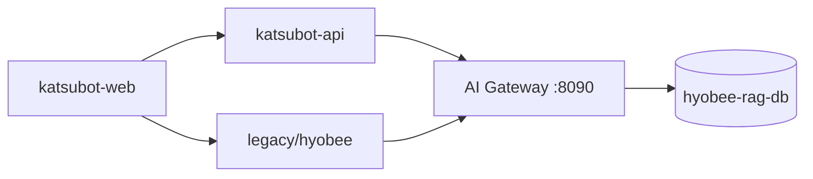

# Katsubot

효성 AI 챗봇 **현대화 모노레포** (KC-007). React SPA, Boot 4.1 API, AI Gateway, 레거시 Hyobee BFF가 한 저장소에서 함께 운영됩니다.

| 모듈 | 경로 | 스택 | 로컬 포트 | 테스트 |
|------|------|------|-----------|--------|
| **katsubot-web** | `apps/katsubot-web` | React · Vite | 5173 | `npm ci && npm test && npm run build` |
| **katsubot-api** | `services/katsubot-api` | Spring Boot 4.1 · JDK 25 | 8081 | `./gradlew :services:katsubot-api:test` |
| **legacy hyobee** | `legacy/hyobee` | Spring Boot 2.7 WAR · JDK 21 | 8080 | `mvn test` |
| **api-contract** | `packages/api-contract` | OpenAPI 3.1 | — | 스펙 diff·리뷰 |
| **infra** | `infra/` | Docker · nginx strangler | 8090 (Gateway) | `./scripts/up-ai-gateway.sh` |

에이전트·로컬 JVM 오버라이드 등 상세 명령: [AGENTS.md](./AGENTS.md)

## 빠른 시작

```bash
# 1) AI Gateway (WRTN + completions — hyobee-rag-db 필요)
cp infra/.env.example infra/.env   # DB 비밀번호·JWT 채우기
./scripts/up-ai-gateway.sh
curl -s http://localhost:8090/_health

# 2) katsubot-api
./scripts/boot-katsubot-api.sh   # :8081

# 3) katsubot-web
cd apps/katsubot-web && npm run dev   # :5173
```

**레거시 BFF + JSP** (SSO·기존 `/xs/aichat/v2` 경로)가 필요하면 `legacy/hyobee`를 별도 기동합니다. 상세: [legacy/hyobee/README.md](./legacy/hyobee/README.md).

**CI·오프라인 RAG 스텁** (8090 — Gateway와 동시 기동 금지):

```bash
cd infra && docker compose --profile stub up -d dummy-rag
```

## 아키텍처 (요약)

```text
katsulabs-katsubot/
├── apps/katsubot-web/           # React SPA (신규 채팅 UX)
├── services/katsubot-api/       # Boot 4.1 BFF
├── packages/api-contract/       # OpenAPI 계약
├── infra/                       # Postgres · AI Gateway · Strangler
└── legacy/hyobee/               # SSO·JSP·v2 BFF (전환기, 신규 기능 금지)
```



다이어그램·인증·Cutover: [docs/03-architecture-flows.md](./docs/03-architecture-flows.md)

## Strangler 라우팅 (Phase 4)

| 경로 | 대상 |
|------|------|
| `/`, `/assets/**` | katsubot-web |
| `/api/v1/**`, `/actuator/**` | katsubot-api |
| `/xs/**`, `/webapps/**` | legacy hyobee |

로컬 strangler·스모크: [docs/04-local-development.md](./docs/04-local-development.md)

## 문서

| 문서 | 설명 |
|------|------|
| [docs/README.md](./docs/README.md) | 문서 목차 |
| [docs/02-modernization-plan.md](./docs/02-modernization-plan.md) | KC-007 현대화 계획 |
| [docs/01-project-conventions.md](./docs/01-project-conventions.md) | 티켓·CI·4역할 규칙 |
| [docs/04-local-development.md](./docs/04-local-development.md) | 로컬 개발·스모크 |
| [legacy/hyobee/README.md](./legacy/hyobee/README.md) | 레거시 Hyobee 전체 매뉴얼 (JSP·SSO·v2 API) |
| [legacy/hyobee/DEPRECATED.md](./legacy/hyobee/DEPRECATED.md) | 레거시 유지·폐기 정책 |

## 관련 저장소

- [katsulabs-ai-gateway](https://github.com/katsulabs/katsulabs-ai-gateway) — WRTN 호환 API·RAG·Direct LLM

---

문서 수정 시 모듈 경로(`katsubot-api`/`katsubot-web`/`legacy/hyobee`)와 실제 코드·OpenAPI 계약이 일치하는지 함께 확인하세요.
