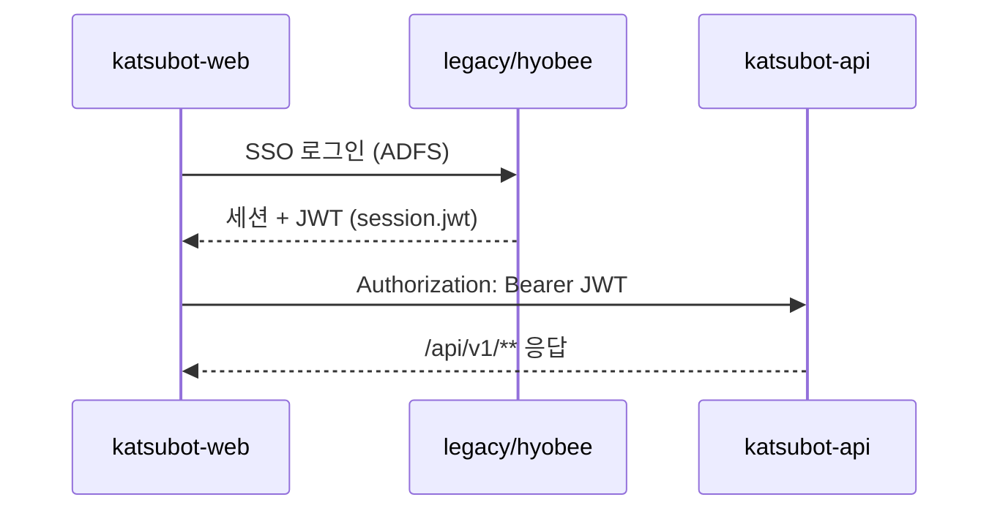
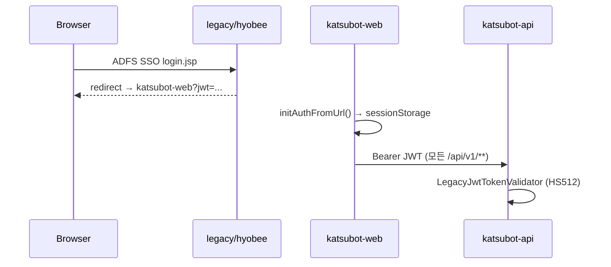
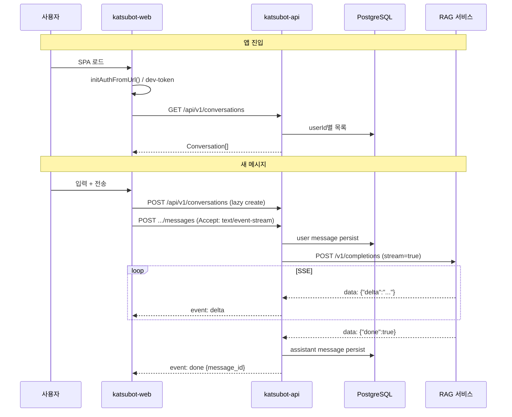
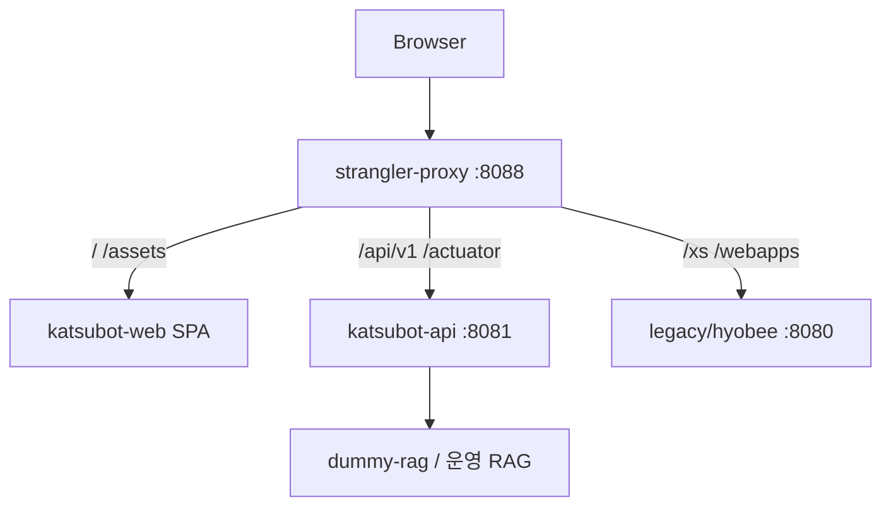
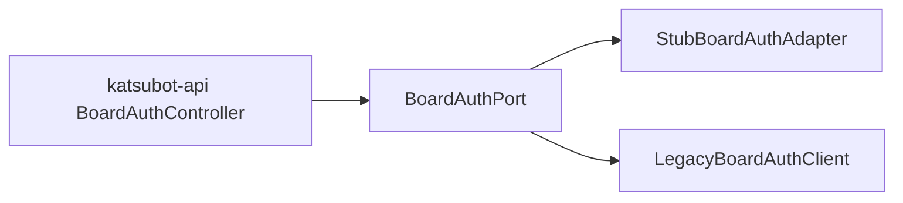
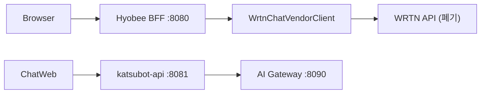
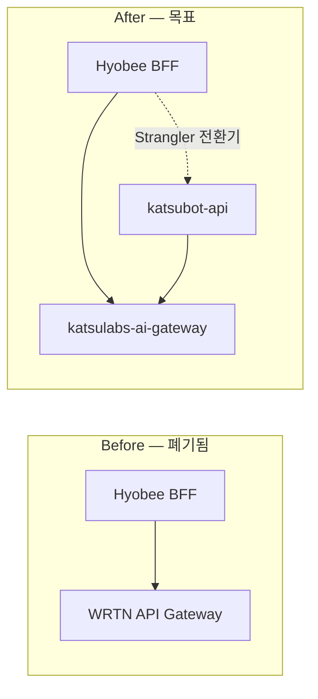

# 03 — 아키텍처·플로우차트

> 시스템 흐름 다이어그램 **단일 모음**. 상세 계약·설정은 각 넘버링 문서 참고.

| § | 주제 | 상세 문서 |
|---|------|-----------|
| 1 | 시스템 개요 | [02-modernization-plan.md](./02-modernization-plan.md) |
| 2 | 인증 (SSO → JWT) | [05-auth-bridge.md](./05-auth-bridge.md) |
| 3 | 채팅 E2E | [10-chat-e2e-gaps.md](./10-chat-e2e-gaps.md) |
| 4 | Strangler Cutover | [09-operations-runbook.md](./09-operations-runbook.md) |
| 5 | Board Auth Port | [07-api-reference.md](./07-api-reference.md) |
| 6 | WRTN → AI Gateway | [08-ai-gateway-handoff.md](./08-ai-gateway-handoff.md) |

---

## §1 시스템 개요 (To-Be)

```text
katsulabs-katsubot/
├── apps/katsubot-web/           # React SPA
├── services/katsubot-api/       # Boot 4.1 BFF (Gradle :services:katsubot-api)
├── packages/api-contract/   # OpenAPI 3.1
├── infra/                   # Postgres · AI Gateway · Strangler
└── legacy/hyobee/           # SSO·v2 (전환기, 신규 기능 금지)
```

---

## §2 인증 — SSO → JWT → katsubot-api



**운영 handoff (Phase 4):**



---

## §3 채팅 E2E



**Frontend 메시지 상태:**

```text
         ┌──────────┐
         │   idle   │
         └────┬─────┘
              │ send()
              ▼
         ┌──────────┐
         │ sending  │── createConversation (if needed)
         └────┬─────┘
              │ SSE open
              ▼
         ┌──────────┐     onDelta
         │streaming │◄────────────
         └────┬─────┘
    error /   │ onDone
    abort     ▼
         ┌──────────┐
         │  sync    │── GET messages (server IDs)
         └────┬─────┘
              ▼
         ┌──────────┐
         │   idle   │
         └──────────┘
```

---

## §4 Strangler Cutover (Phase 4)



---

## §5 Board Auth Port



---

## §6 WRTN → AI Gateway

**현재 연동 (As-Is / 전환기):**



**목표 (After):**


