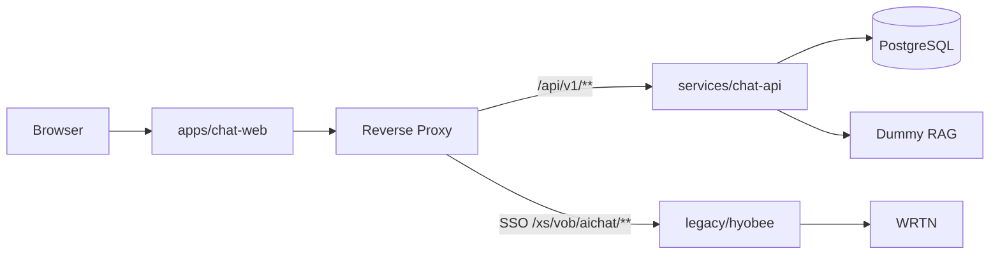

# KC-007-modernization — 챗봇 현대화 작업계획서 (승인용)


| 항목    | 값                                                                        |
| ----- | ------------------------------------------------------------------------ |
| 티켓    | `KC-007-modernization`                                                   |
| 제품    | Katsulabs Chatbot (`katsubot`)                                           |
| 상태    | **승인됨 (APPROVED)** — 2026-06-26 |
| 작성일   | 2026-06-25                                                               |
| 예상 기간 | Phase 0–2: **8–10주** (1 FTE, 병렬 시 단축)                                    |
| 운영 규칙 | [KC-000-project-conventions.md](./harness/KC-000-project-conventions.md) |


---

## 승인 요약 (1페이지)

### 무엇을 하는가

레거시 단일 WAR(Spring Boot 2.7 · JSP · WRTN 직연동)를 **모노레포 멀티모듈**로 분리하고, **React + Spring Boot 4.1 + JDK 25 + Gradle + Clean Architecture** 기반 신규 챗봇 스택을 Strangler 방식으로 구축한다.

### 권장 결정


| 항목       | 권장안                                                             |
| -------- | --------------------------------------------------------------- |
| 저장소 구조   | **구조안 B** — 모노레포 + Gradle 멀티모듈                                  |
| Frontend | React + TypeScript + Vite                                       |
| Backend  | Spring Boot 4.1, JDK 25, Gradle (`services/chat-api`)           |
| DB       | PostgreSQL (신규 `chat` 스키마, 레거시와 분리)                             |
| RAG      | Phase 0–2 **Dummy RAG** → Phase 3+ WRTN/Agentic RAG (Port 뒤 교체) |
| ORM      | **JPA Optional** — 대화 메타만 JPA, 스트림·레거시 조회는 Adapter              |
| CI/CD    | GitHub Actions 3종 (chat-api / chat-web / legacy)                |
| 레거시      | `legacy/hyobee` 동결·축소, SSO는 전환기 브릿지                             |


### 승인 체크리스트

- [x] **STRUCT** 구조안 B(모노레포) 확정 — A(멀티레포)/C(Big Bang) 아님
- [x] **STACK** React · Boot 4.1 · JDK 25 · Gradle 확정
- [x] **SCOPE** Phase 0 착수 승인 (스캐폴딩·CI, 기능 변경 최소)
- [x] **RAG** Dummy → 실 RAG 전환은 Phase 3 별도 승인에 동의
- [x] **LEGACY** Strangler 전환·레거시 동결 정책 이해

### 승인란


| 역할                | 이름    | 날짜         | 결정                    |
| ----------------- | ----- | ---------- | --------------------- |
| Product / Sponsor | (승인자) | 2026-06-26 | ☑ Phase 0 착수          |
| Tech Lead         | —     | 2026-06-26 | ☑ 구조안 B               |
| Backend           | —     | 2026-06-26 | ☑ Boot 4.1 + JDK 25   |
| Frontend          | —     | 2026-06-26 | ☑ React + Vite + TS   |
| QA                | —     | 2026-06-26 | ☑ 모듈별 CI 게이트 합의      |


**수정 요청 메모:**

```text

```

---

## 1. 배경·현황 (As-Is)

```text
ㄴㅂkatsulabs-chatbot-api/          # 현재 (Phase 0 전)
├── pom.xml                     # Boot 2.7.18, Java 21, Maven, WAR
├── src/main/java/xs/           # 채팅 v2 API, SSO, 로그인, 레거시 VOB
├── src/main/webapp/            # JSP (login.jsp, main.jsp)
└── docs/harness/               # KC-000 운영 규칙
```


| 항목           | 현재                                         |
| ------------ | ------------------------------------------ |
| 배포           | 단일 WAR, 외장 Tomcat 9 (`javax.*`)            |
| UI           | JSP + vanilla JS, SSE 스트리밍                 |
| LLM          | WRTN API 직접 연동 (`/xs/aichat/v2/stream/**`) |
| 아키텍처         | Layered MVC                                |
| in-place 현대화 | **불가** — Boot 3+ / Jakarta는 Tomcat 10+ 필요  |


---

## 2. 목표 (To-Be · Epic DoD)

Epic 완료 시:

1. `apps/chat-web` — React 채팅 UI, Dummy RAG(및 선택적 WRTN) SSE E2E
2. `services/chat-api` — Clean Architecture, Boot 4.1, JDK 25, PostgreSQL, REST/SSE
3. `legacy/hyobee` — SSO·운영 경로 유지, Strangler proxy 준비
4. `packages/api-contract` — OpenAPI 단일 계약
5. GitHub Actions — 모듈별 CI green
6. Phase 2까지 v2 핵심 API **기능 매트릭스 80%+**

---

## 3. 프로젝트 구조

### 3.1 구조안 비교


| 안                        | 설명                       | 판단                            |
| ------------------------ | ------------------------ | ----------------------------- |
| **A** 멀티레포               | web / api / legacy 각각 분리 | 팀·배포 완전 분리 시만                 |
| **B** 모노레포 멀티모듈          | 아래 To-Be 트리              | **✅ 권장**                      |
| **C** 단일 Gradle Big Bang | 레거시 일괄 Boot 4 이전         | **❌ 비권장** (Tomcat 9·javax 제약) |


### 3.2 To-Be 트리 (구조안 B)

```text
katsulabs-chatbot-api/
├── settings.gradle.kts
├── legacy/hyobee/              # Maven WAR (전환기 동결)
├── services/chat-api/          # Boot 4.1, JDK 25
├── apps/chat-web/              # React (Vite)
├── packages/api-contract/      # OpenAPI
├── infra/docker-compose.yml    # Postgres + dummy-rag
└── .github/workflows/          # chat-api-ci, chat-web-ci, legacy-ci
```

### 3.3 모듈 책임


| 모듈                      | 빌드     | 책임                           |
| ----------------------- | ------ | ---------------------------- |
| `legacy/hyobee`         | Maven  | SSO, JSP, v2 API (축소 대상)     |
| `services/chat-api`     | Gradle | BFF, Use Case, RAG/Auth Port |
| `apps/chat-web`         | pnpm   | 채팅 SPA                       |
| `packages/api-contract` | —      | OpenAPI · 생성 클라이언트           |


### 3.4 Clean Architecture (`chat-api`)

```text
interfaces/      → REST, SSE
application/     → Use Case
domain/          → Entity, Port (프레임워크 무의존)
infrastructure/  → JPA, WebClient, DummyRagAdapter, AuthAdapter
```

### 3.5 Strangler 라우팅




| 단계        | 트래픽                                 |
| --------- | ----------------------------------- |
| Phase 0–1 | React → chat-api; SSO는 레거시 redirect |
| Phase 2   | 대화 CRUD → chat-api; v2 점진 축소        |
| Phase 3+  | WRTN을 Port 어댑터로 통합                  |


---

## 4. 기술 스택

### 4.1 채택 스택


| 영역       | 선택                              | 비고                     |
| -------- | ------------------------------- | ---------------------- |
| Frontend | React + TS + Vite 6+            | TanStack Query, Vitest |
| Backend  | Spring Boot **4.1**, JDK **25** | **신규 모듈만**             |
| Build    | Gradle (멀티모듈)                   | 레거시는 Maven 유지          |
| DB       | PostgreSQL                      | Flyway, 스키마 `chat`     |
| RAG      | Dummy API → Port 교체             | Phase 1 Docker Compose |
| CI       | GitHub Actions                  | path filter 3 workflow |


### 4.2 레거시 vs 신규


|             | legacy/hyobee        | services/chat-api      |
| ----------- | -------------------- | ---------------------- |
| Servlet     | `javax.`* / Tomcat 9 | `jakarta.*` / embedded |
| Spring Boot | 2.7.x                | 4.1                    |
| Jackson     | 2.x                  | 3.x                    |


### 4.3 JPA (Optional)


| 데이터           | 접근                           |
| ------------- | ---------------------------- |
| 대화·메시지·피드백 메타 | JPA 또는 JDBC                  |
| SSE·스트리밍      | WebClient (비영속)              |
| 레거시 테이블       | JDBC Adapter (Phase 2+, ACL) |


### 4.4 Dummy RAG (최소 계약)

```http
POST /v1/completions
{ "query": "...", "conversation_id": "...", "stream": true }
```

→ SSE `data: {"delta":"..."}` · Phase 3에서 `WrtnRagAdapter`로 교체

### 4.5 CI/CD (Phase 0)


| Workflow          | 경로                     | 게이트                       |
| ----------------- | ---------------------- | ------------------------- |
| `chat-api-ci.yml` | `services/chat-api/**` | JDK 25, `./gradlew test`  |
| `chat-web-ci.yml` | `apps/chat-web/**`     | `pnpm test`, `pnpm build` |
| `legacy-ci.yml`   | `legacy/**`            | JDK 21, `mvn test` (터치 시) |


### 4.6 아키텍처 트렌드 (Phase 3+ 참고)

- **Phase 1–2:** SSE + REST, Dummy RAG, OpenAPI contract
- **Phase 3+:** Router Agent → bounded Agentic RAG (`max_iter` 3–4, timeout 12s)
- 오케스트레이션 후보: Spring AI 또는 Port + 자체 Router POC
- 관측성: OpenTelemetry, 구조화 로그 (`conversation_id` 상관)

---

## 5. 실행 계획

### Phase 개요

```text
Phase 0  구조·스캐폴딩·CI     2주
Phase 1  MVP API + React      3주
Phase 2  대화·Strangler       3–4주
Phase 3+ RAG 고도화           별도 승인
Phase 4  레거시 decommission  요구 시
```

### Phase 0 — 구조·스캐폴딩 (2주)


| ID  | 작업                           | 산출물                                          |
| --- | ---------------------------- | -------------------------------------------- |
| 0-1 | 모노레포 디렉터리 스캐폴딩               | `legacy/`, `services/`, `apps/`, `packages/` |
| 0-2 | `src/` → `legacy/hyobee/` 이동 | git history preserve                         |
| 0-3 | chat-api Boot 4.1 skeleton   | `/actuator/health`                           |
| 0-4 | chat-web Vite+React+TS       | dev server                                   |
| 0-5 | docker-compose               | Postgres + dummy-rag                         |
| 0-6 | GitHub Actions 3종            | CI green                                     |
| 0-7 | JDK 25 / Node 22 CI 검증       | —                                            |


**DoD:** legacy `mvn test` green · chat-api health 200 · chat-web build · Dummy RAG SSE · README 갱신

**게이트:** G0 빌드 분리 무손상 · G1 CI 3종 green

### Phase 1 — MVP (3주)

**Contract 선행 (1주차)**


| ID   | 산출물                                                                 |
| ---- | ------------------------------------------------------------------- |
| 1-C1 | `packages/api-contract/openapi.yaml` — conversations, messages(SSE) |
| 1-C2 | `docs/auth-bridge.md` — JWT vs 레거시 세션                               |
| 1-C3 | RAG Port 인터페이스 정의                                                   |


**Backend:** Use Case (`CreateConversation`, `SendMessage`), `DummyRagAdapter`, Flyway V1, JPA 엔티티(optional), 단위 테스트

**Frontend:** 로그인 redirect(레거시), 채팅 UI, SSE hook, OpenAPI 클라이언트

**DoD:** 로그인 → React → Dummy RAG 스트리밍 1건 · Use Case 테스트 · Contract로 BE/FE 병렬 가능

**게이트:** G2 OpenAPI breaking 없음 · G3 401/403 계약 테스트

### Phase 2 — 대화·Strangler (3–4주)

- v2 API parity 분석·이전 (목록, 삭제, 히스토리, 피드백)
- `board-auth` 권한 Port (레거시 브릿지)
- Reverse proxy: `/api/v1/`** → chat-api, SSO → legacy
- Testcontainers 통합 테스트
- Frontend: 대화 목록, 에러 UX

**DoD:** 기능 매트릭스 80%+ · 스테이징 proxy 1회 · legacy CI green

**게이트:** G4 매트릭스 리뷰 · G5 SSE 5분 연결 스모크

### Phase 3+ — RAG 고도화 (별도 승인)


| 작업               | 비고                        |
| ---------------- | ------------------------- |
| `WrtnRagAdapter` | HyobeeChatApiClient 로직 이전 |
| Router Agent     | 단순/복잡 질의 분기               |
| 하이브리드 검색         | pgvector 등                |
| OpenTelemetry    | 대시보드                      |


**착수 조건:** Phase 2 DoD + 운영 배포 승인 + WRTN 계약

---

## 6. 리스크


| ID  | 리스크                  | 영향  | 완화                             |
| --- | -------------------- | --- | ------------------------------ |
| R1  | 경로 이동으로 legacy CI 깨짐 | 높음  | Phase 0 전용 PR, `mvn test` 게이트  |
| R2  | SSO·세션 브릿지 복잡도       | 높음  | Contract 선행, JWT verify 재사용    |
| R3  | JDK 25 CI/배포         | 중간  | Docker pin, JDK 21 fallback 옵션 |
| R4  | Boot 4 / Jackson 3   | 중간  | 신규 모듈만                         |
| R5  | 레거시·신규 병행 리소스        | 중간  | legacy 동결, KC-007 집중           |


---

## 7. 운영·역할

4역할 Sub-agent: **Contract → Backend → Frontend → QA**


| Role     | 범위                                      |
| -------- | --------------------------------------- |
| Contract | OpenAPI, Port, auth-bridge 문서           |
| Backend  | `services/chat-api/`**                  |
| Frontend | `apps/chat-web/**`                      |
| QA       | CI, PR 게이트 (`katsubot-pr-harness-gate`) |


브랜치: `feature/KC-007-modernization-phase0-scaffold`  
태그: `[KC-007-modernization][Backend]` 등

상세: [KC-000](./harness/KC-000-project-conventions.md) · [agent-hierarchy.md](./harness/agent-hierarchy.md)

---

## 8. 착수 조건 · 승인 후 즉시 액션

**Definition of Ready**

- [x] §승인란 완료 (2026-06-26)
- [ ] worktree: `feature/KC-007-modernization-phase0-scaffold`
- [ ] PostgreSQL·Secrets 정책 합의 (`katsubot-secrets-prep`)

**승인 직후**

1. worktree 생성 (`katsubot-worktree-ticket`)
2. Phase 0 PR — 디렉터리 이동 + 스캐폴딩 only
3. Contract — `auth-bridge.md` + OpenAPI 초안
4. `docs/harness/todo.md` 상태를 **IN PROGRESS**로 갱신

---

## 부록 — 거부된 대안


| 대안                         | 사유                           |
| -------------------------- | ---------------------------- |
| Boot 3.5 + JDK 21 only     | 요구 스택 미충족                    |
| 멀티레포 (구조안 A)               | Strangler·계약 동기화 비용          |
| in-place Boot 4 이전 (구조안 C) | Tomcat 9 / javax 제약          |
| Next.js full-stack         | BFF·Clean Architecture 경계 모호 |
| 전면 JPA                     | SSE·레거시 스키마에 부적합             |


