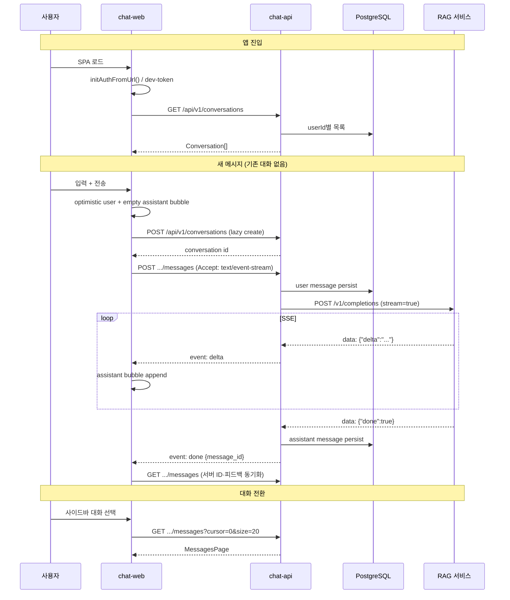
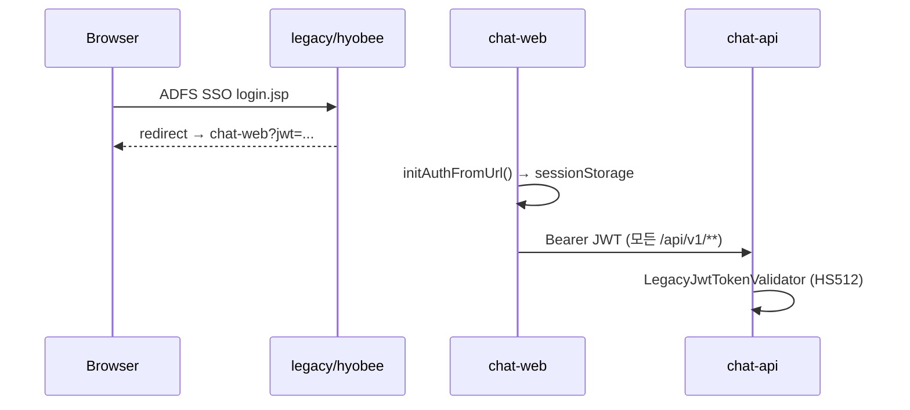

# 채팅 Flow 분석 — Katsubot Chat E2E

| 항목 | 값 |
|------|-----|
| 문서 | chat-flow-analysis |
| 티켓 후보 | KC-008-chat-e2e (또는 KC-007 잔여) |
| 작성일 | 2026-06-27 |
| 상태 | **분석·설계** (구현 전) |
| 근거 | [KC-007-modernization-plan.md](../KC-007-modernization-plan.md), [openapi.yaml](../../packages/api-contract/openapi.yaml) |

---

## 1. 요약

**결론:** 채팅 E2E는 **별도 저장소가 아니라 기존 모노레포 3모듈**(`chat-web` → `chat-api` → RAG)로 완성하는 것이 맞다. Phase 0–4에서 API·UI·인프라 골격은 이미 존재하며, **“채팅이 동작한다”**는 상태는 아래 갭을 메우면 달성된다.

| 우선순위 | 갭 | 영향 |
|----------|-----|------|
| P0 | 로컬 3-tier 기동·연결 (dummy-rag + chat-api + chat-web) | 메시지 전송 자체 |
| P0 | SSE 스트림 UX (에러·중단·재시도) | 사용자 체감 |
| P1 | `chat_category` (사내/웹 검색) API·RAG 전달 | UI 토글과 실제 동작 불일치 |
| P1 | 피드백(like/dislike) UI | v2 parity |
| P2 | OpenAPI 생성 클라이언트·TanStack Query | 유지보수·KC-000 정합 |
| P2 | `ChatPage` 분리 (hooks / presentational) | 558줄 단일 컴포넌트 |

**폴더 권장:** 신규 top-level repo `katsulabs-katsubot-chat` **비권장**. 대신 `docs/chat/`(본 문서), 선택적 `packages/chat-client/`(OpenAPI 생성 TS SDK).

---

## 2. 현재 상태 (As-Is)

### 2.1 모듈 지도

```text
katsulabs-katsubot/
├── apps/chat-web/              # React SPA — ChatPage UI + 수동 api.ts
├── services/api/               # Gradle 모듈명 :services:chat-api (경로 alias)
├── packages/api-contract/      # OpenAPI 0.2.0
├── infra/dummy-rag/            # 로컬 RAG 스텁 (SSE)
└── legacy/hyobee/              # Strangler — SSO·v2 API (신규 기능 금지)
```

> **주의:** `settings.gradle.kts`에서 `:services:chat-api` → `services/api` 디렉터리로 매핑. 문서·경로 혼동 방지를 위해 장기적으로 `services/api` → `services/chat-api` rename 권장.

### 2.2 이미 구현된 것

| 계층 | 구현 | 상태 |
|------|------|------|
| Contract | `POST/GET/DELETE /api/v1/conversations`, `GET/POST .../messages`, feedback, board-auth | ✅ OpenAPI |
| Backend | Clean Architecture Use Case, JPA/in-memory, JWT, `RagCompletionPort` | ✅ 코드 존재 |
| Frontend | 대화 목록·생성·삭제, 메시지 히스토리, SSE 전송, Hyobee 레거시 UI 스킨 | ✅ ChatPage |
| Infra | dummy-rag `/v1/completions` SSE | ✅ |
| Auth (로컬) | `dev-token` + `KATSUBOT_AUTH_DEV_BYPASS=true` | ✅ |

### 2.3 미연결·미완성

| 항목 | UI | API | 비고 |
|------|----|-----|------|
| 사내/웹 검색 토글 | ✅ `searchType` state | ❌ `SendMessageRequest`에 필드 없음 | 레거시 `chat_category`: `internal_rules` / `web_search` |
| 피드백 | ❌ | ✅ PUT/DELETE | OpenAPI·Controller 존재 |
| 저널(R&D) | 버튼만 | ❌ (KC-007 범위 외) | Phase 2+ |
| 파일 업로드 | ❌ | ❌ | v2 parity 보류 |
| 스트림 취소 | ❌ AbortController | ❌ emitter cancel | UX |
| SSE `event: error` | ❌ 파싱 없음 | ✅ MessageController | api.ts는 delta/done만 |
| OpenAPI 생성 클라이언트 | ❌ 수동 `api.ts` | — | KC-000 Frontend 규칙 |
| TanStack Query | ❌ useState | — | KC-000 Frontend 규칙 |

---

## 3. 권장 채팅 Flow (To-Be)

### 3.1 End-to-End 시퀀스



### 3.2 레이어별 책임

| 레이어 | 책임 | 하지 않을 것 |
|--------|------|--------------|
| **chat-web** | UI 상태, optimistic update, SSE 소비, 401 UX | RAG 직접 호출, JWT 검증 |
| **chat-api** | 인증, 소유권, 영속화, RAG Port 호출, SSE 중계 | LLM·벡터 검색 로직 |
| **RAG 서비스** | 검색·생성·`web_search_enabled` 등 | 대화 메타 CRUD |
| **legacy/hyobee** | SSO, JWT 발급, cutover 전 proxy | 신규 v1 API |

### 3.3 메시지 전송 상태 머신 (Frontend)

```text
         ┌──────────┐
         │   idle   │
         └────┬─────┘
              │ send()
              ▼
         ┌──────────┐     createConversation (if needed)
         │ sending  │──────────────────────────────┐
         └────┬─────┘                              │
              │ SSE open                           │
              ▼                                    │
         ┌──────────┐     onDelta                  │
         │streaming │◄─────────────────────────────┤
         └────┬─────┘                              │
    error /   │ onDone                             │
    abort     ▼                                    │
         ┌──────────┐                              │
         │  sync    │── GET messages (server IDs)  │
         └────┬─────┘                              │
              ▼                                    │
         ┌──────────┐◄─────────────────────────────┘
         │   idle   │
         └──────────┘
```

**규칙:**

1. **Optimistic UI:** 사용자 메시지는 즉시 렌더; assistant는 빈 버블 + delta 누적.
2. **done 후 sync:** `crypto.randomUUID()` 임시 ID → 서버 `message_id`로 교체 (피드백·히스토리 일관성).
3. **streaming 중:** 입력 비활성, (선택) AbortController로 취소.
4. **401/403:** 토큰 만료 안내 + 레거시 로그인 redirect (Phase 4 cutover).

### 3.4 검색 모드 (`chat_category`) 전달

레거시 v2는 대화·메시지에 `chat_category`를 붙인다.

| UI | 레거시 값 | RAG 전달 (제안) |
|----|-----------|-----------------|
| 사내검색 | `internal_rules` | `web_search_enabled: false` |
| 웹검색 | `web_search` | `web_search_enabled: true` |

**계약 변경 (Contract 우선):**

```yaml
# SendMessageRequest 확장 (openapi.yaml)
SendMessageRequest:
  properties:
    content: ...
    chat_category:
      type: string
      enum: [internal_rules, web_search]
      default: internal_rules
```

Backend: `RagCompletionRequest`에 `chatCategory` 추가 → `RagHttpClient`가 RAG body에 매핑.

Frontend: `sendMessageStream(id, content, { chat_category: chatCategory })`.

---

## 4. 폴더·모듈 구성 옵션

### 옵션 A — 현재 모노레포 유지 (권장)

```text
katsulabs-katsubot/
├── docs/chat/                  # ← 본 분석·flow·QA 시나리오
├── apps/chat-web/
│   └── src/
│       ├── features/chat/      # ChatPage 분리
│       ├── hooks/useChat*.ts
│       └── lib/api.ts → packages/chat-client
├── services/chat-api/          # (rename from services/api)
└── packages/
    ├── api-contract/
    └── chat-client/            # (선택) openapi-typescript 생성
```

| 장점 | 단점 |
|------|------|
| KC-007·KC-000와 일치 | chat-web 내부 refactor 필요 |
| Contract 단일 소스 | |
| CI path filter 이미 분리 | |

### 옵션 B — `packages/chat-client` 추출

OpenAPI → TypeScript SDK를 패키지로 분리. chat-web과 향후 admin·mobile이 공유.

| 장점 | 단점 |
|------|------|
| 타입·fetch 로직 중복 제거 | codegen 파이프라인 추가 |
| Contract breaking change 조기 감지 | 초기 설정 비용 |

### 옵션 C — 별도 repo `katsulabs-katsubot-chat`

| 장점 | 단점 |
|------|------|
| 팀 완전 분리 시 | OpenAPI·CI·버전 동기화 비용 |
| | KC-007 Strangler·auth-bridge 단절 |
| | **비권장** |

**권장:** **A + (점진) B**. 별도 repo는 만들지 않는다.

---

## 5. chat-web 내부 구조 (제안)

558줄 `ChatPage.tsx`를 feature 단위로 분리:

```text
apps/chat-web/src/
├── features/chat/
│   ├── ChatPage.tsx            # layout shell only
│   ├── ChatSidebar.tsx         # 대화 목록·삭제 모드
│   ├── ChatThread.tsx          # 메시지 목록·welcome
│   ├── ChatComposer.tsx        # 입력·검색 토글·전송
│   └── MessageBubble.tsx
├── hooks/
│   ├── useConversations.ts     # TanStack Query
│   ├── useMessages.ts
│   └── useSendMessage.ts       # SSE + AbortController
└── lib/
    └── api/                    # 또는 @katsubot/chat-client
```

**데이터 fetching:** TanStack Query로 목록·히스토리; SSE는 mutation + stream handler.

---

## 6. 로컬에서 “채팅 동작” 확인 절차

[phase1-local-smoke.md](../harness/phase1-local-smoke.md) 기준:

```bash
# 1. RAG 스텁
cd infra && docker compose up -d dummy-rag

# 2. chat-api (in-memory)
./gradlew :services:chat-api:bootRun

# 3. chat-web
cd apps/chat-web && npm run dev

# 4. 브라우저 http://localhost:5173 — 메시지 입력 → Dummy RAG 스트리밍
```

**curl only:** `./scripts/smoke-phase1.sh`

---

## 7. 구현 단계 (권장 순서)

| Phase | 범위 | 역할 | DoD |
|-------|------|------|-----|
| **1. Wire-up** | 로컬 3-tier, dev-token, Vite proxy | QA + Dev | smoke-phase1 green, 브라우저 스트리밍 |
| **2. SSE hardening** | error event, abort, 재시도 UX | Frontend | 단위 테스트 `consumeSseBuffer` + error |
| **3. chat_category** | OpenAPI → Backend → Frontend → RAG body | Contract→Backend→Frontend | 토글 변경 시 RAG 요청 분기 |
| **4. Feedback UI** | like/dislike on assistant messages | Frontend | PUT/DELETE 연동 |
| **5. Refactor** | hooks, TanStack Query, chat-client pkg | Frontend | ChatPage < 200줄 |
| **6. JPA 로컬** | postgres profile, Flyway | Backend | 재시작 후 대화 유지 |

---

## 8. 인증 Flow (운영)



로컬: `VITE_AUTH_TOKEN=dev-token`, `katsubot.auth.dev-bypass=true`.

---

## 9. 리스크·결정 사항

| 리스크 | 완화 |
|--------|------|
| RAG 실서비스 URL·계약 불일치 | `docs/rag-external-client.md` + RagHttpClient 통합 테스트 |
| SSE 60s timeout (SseEmitter) | 장문 응답 시 timeout 연장 또는 heartbeat |
| 임시 message ID vs 서버 ID | done 후 `loadHistory` (현재) → ID merge로 개선 |
| `services/api` vs `chat-api` 혼동 | Gradle rename 또는 README 명시 |

**사용자 결정 필요 (1건):**

- `chat_category`를 **대화 생성 시 고정** vs **메시지마다 변경 가능**  
  - 레거시: 대화 단위 category. **권장:** 대화 생성 시 `chat_category` 저장, 동일 대화 내 전환 시 새 대화 유도 또는 category 변경 API (Phase 2).

---

## 10. 다음 단계

1. 본 문서 리뷰·승인
2. `[KC-008][Contract]` — `chat_category` OpenAPI PR
3. `[KC-008][Backend]` — Domain + RagHttpClient
4. `[KC-008][Frontend]` — useSendMessage + UI gap
5. `[KC-008][QA]` — E2E smoke + phase1 브라우저 체크리스트

---

## 부록 A — API ↔ UI 매핑

| 사용자 액션 | API | ChatPage 함수 |
|-------------|-----|---------------|
| 앱 로드 | GET /conversations | `loadConversations` |
| 새 대화 | POST /conversations | `startNewConversation` |
| 대화 선택 | GET .../messages | `selectConversation` → `loadHistory` |
| 메시지 전송 | POST .../messages (SSE) | `send` → `sendMessageStream` |
| 대화 삭제 | DELETE /conversations | `removeSelectedConversations` |
| (미구현) 피드백 | PUT/DELETE .../feedback | — |

## 부록 B — 참고 문서

- [KC-007-modernization-plan.md](../KC-007-modernization-plan.md)
- [openapi.yaml](../../packages/api-contract/openapi.yaml)
- [auth-bridge.md](../auth-bridge.md)
- [rag-external-client.md](../rag-external-client.md)
- [v2-parity-matrix.md](../modernization/v2-parity-matrix.md)
- [phase1-local-smoke.md](../harness/phase1-local-smoke.md)
