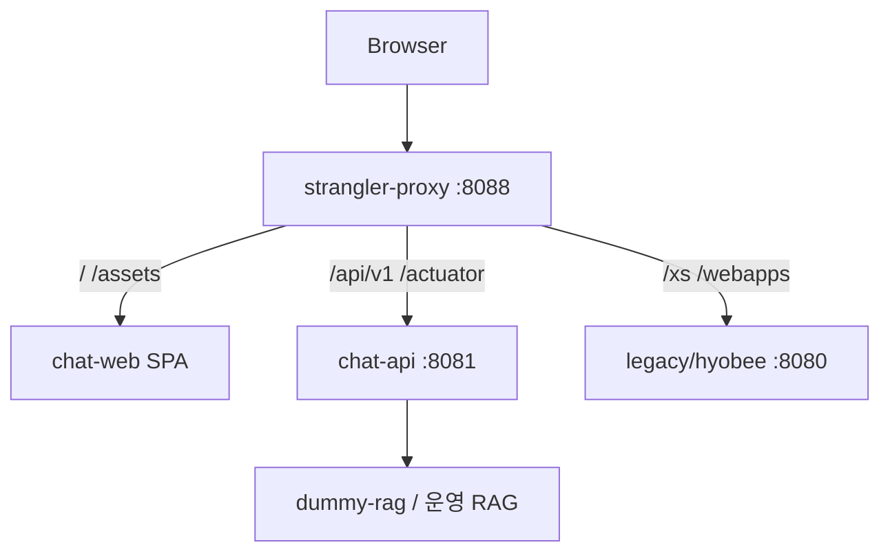

# 레거시 Decommission Runbook (Phase 4)

> Strangler cutover — 단일 진입점(`:8088`)에서 React + chat-api 제공, legacy는 SSO·JSP만.

## 아키텍처 (Phase 4)



## 라우팅

| 경로 | Upstream | 비고 |
|------|----------|------|
| `/` | chat-web | React SPA (`try_files` fallback) |
| `/api/v1/**` | chat-api | BFF REST/SSE |
| `/actuator/**` | chat-api | health (내부망 제한 권장) |
| `/xs/**` | legacy | SSO·v2 잔여 — `Deprecation` 헤더 |
| `/webapps/**` | legacy | JSP |
| `/healthz` | proxy | liveness |

## 로컬 Cutover

```bash
# 1. 인프라
cd infra
docker compose up -d postgres dummy-rag

# 2. chat-api (호스트)
./gradlew :services:chat-api:bootRun

# 3. Strangler + chat-web (Docker)
docker compose -f docker-compose.yml -f docker-compose.strangler.yml up -d --build

# 4. 스모크
PROXY_BASE=http://localhost:8088 ./scripts/smoke-phase4.sh
```

## 인증 (전환기)

1. **개발:** `Bearer dev-token` (`katsubot.auth.dev-bypass`)
2. **스테이징:** legacy SSO → redirect `/?jwt=<token>` → chat-web `sessionStorage`
3. **운영:** 동일 handoff 또는 IdP 직접 연동 (Phase 4+)

## 레거시 Deprecation

nginx가 `/xs/**`, `/webapps/**` 응답에 추가:

- `Deprecation: true`
- `Link: </api/v1/>; rel="successor-version"`

## 롤백

1. Strangler에서 `/` → legacy JSP URL로 임시 redirect (nginx `return 302`)
2. chat-api 트래픽 유지 또는 `/api/v1` → legacy v2 프록시 (Phase 2 설정)

## 게이트 G8

| ID | 기준 |
|----|------|
| G8 | 프록시 단일 origin — SPA 200 + API SSE + 히스토리 (legacy 미기동 가능, dev-token) |

## 참고

- [phase4-cutover-smoke.md](../harness/phase4-cutover-smoke.md)
- [auth-bridge.md](../auth-bridge.md)
