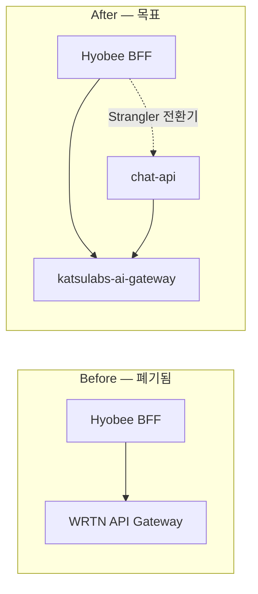

# WRTN → katsulabs-ai-gateway 마이그레이션 Handoff

> **배경:** WRTN upstream API 서버(`WRTN_BASEURL`)가 **폐기**됨.  
> 레거시 `WrtnChatVendorClient`가 호출하던 14개 HTTP API를 **katsulabs-ai-gateway**가 대체해야 한다.

## 1. 수신자·목적

| 항목 | 내용 |
|------|------|
| **수신 repo** | [katsulabs-ai-gateway](https://github.com/katsulabs/katsulabs-ai-gateway) |
| **발신 repo** | katsulabs-katsubot (본 문서 + OpenAPI + 프롬프트) |
| **목표** | Hyobee BFF가 `WRTN_BASEURL`만 Gateway URL로 바꿔 **동일 경로·계약**으로 재연결 |
| **부가 목표** | chat-api `RagHttpClient`용 `/v1/completions`는 **유지·확장** (얇은 어댑터 또는 공유 코어) |

## 2. 첨부 산출물 (이 repo)

| 파일 | 용도 |
|------|------|
| [`packages/api-contract/ai-gateway-wrtn-replacement-openapi.yaml`](../../packages/api-contract/ai-gateway-wrtn-replacement-openapi.yaml) | **구현 대상** OpenAPI 3.1 (우선순위·SSE·스키마) |
| [`packages/api-contract/wrtn-upstream-openapi.yaml`](../../packages/api-contract/wrtn-upstream-openapi.yaml) | 역공학 원본 (참고) |
| [`docs/modernization/wrtn-upstream-api.md`](./wrtn-upstream-api.md) | API 목록·Hyobee 후처리·인증 분기 설명 |
| [`docs/modernization/wrtn-to-ai-gateway-prompt.md`](./wrtn-to-ai-gateway-prompt.md) | Gateway repo 에이전트/개발자용 **복붙 프롬프트** |
| [`docs/rag-external-client.md`](../rag-external-client.md) | chat-api ↔ Gateway **기존** 얇은 계약 (`/v1/completions`) |

### 근거 Java (katsubot)

```
legacy/hyobee/src/main/java/xs/aichat/v2/external/WrtnChatVendorClient.java   ← 호출부 (마이그레이션 대상)
legacy/hyobee/src/main/java/xs/aichat/interfaces/HyobeeChatApiClient.java     ← HTTP·JWT·로깅
legacy/hyobee/src/main/java/xs/aichat/v2/external/WrtnRequestMapper.java      ← query/body 매핑
legacy/hyobee/src/main/java/xs/aichat/v2/dto/external/wrtn/**                 ← request/response DTO
legacy/hyobee/src/main/java/xs/aichat/v2/service/ChatStreamServiceImpl.java   ← SSE status 처리
```

## 3. 아키텍처 (Before / After)



**Hyobee 측 변경 (최소):**

```properties
# xtrm property / env
WRTN_BASEURL=https://<ai-gateway-host>   # 기존 wrtn.ai URL → Gateway
```

코드 변경 없이 base URL 교체만으로 붙는 것이 **1차 성공 기준**이다.

## 4. API 교체 매트릭스

| P | Method | Path | Hyobee 메서드 | Gateway 책임 |
|---|--------|------|---------------|--------------|
| **P0** | GET | `/_health` | `healthCheck` | Liveness |
| **P0** | POST | `/api/v1/conversations/{id}/ai-chat` | `startChatStream` | LLM/RAG SSE (**핵심**) |
| **P0** | GET | `/api/v1/conversations` | `selectConversations` | 대화 목록 persistence |
| **P0** | POST | `/api/v1/conversations` | `createConversation` | 대화 생성 |
| **P0** | GET | `/api/v1/conversations/{id}/messages` | `selectMessages` | 메시지 히스토리 |
| **P1** | DELETE | `/api/v1/conversations` | `deleteConversations` | 대화 삭제 |
| **P1** | POST | `.../messages/{msgId}/interrupt` | `interrupt` | 스트림 취소 |
| **P1** | PUT | `.../feedback` | `feedback` | 피드백 |
| **P1** | DELETE | `.../feedback/{feedbackId}` | `deleteFeedback` | 피드백 삭제 |
| **P2** | GET | `/api/v1/boards/auth` | `selectDataBoardsAuth` | 게시판 권한 (현재 query 없음) |
| **P2** | GET | `.../messages/{msgId}/sources` | `selectMessageSources` | RAG 출처 목록 |
| **P2** | GET | `/api/v2/rnd/journal` | `selectJournals` | R&D 저널 검색 |
| **P2** | GET | `/api/v2/rnd/journal/{id}` | `selectJournalDetail` | 저널 상세 |
| **P2** | GET | `.../related-items` | `selectJournalRelatedItems` | 연관 저널 |
| **P2** | GET | `.../ai-summary` | `selectJournalAiSummary` | AI 요약 |

### chat-api 전용 (WRTN 경로 아님 — **유지**)

| Method | Path | 비고 |
|--------|------|------|
| GET | `/_health` | 동일 |
| POST | `/v1/completions` | `RagHttpClient` — Gateway 내부에서 ai-chat 코어 재사용 권장 |

## 5. SSE 계약 (Hyobee 호환 — **중요**)

Hyobee `WrtnChatVendorClient.startChatStream`은 upstream에서 **JSON 한 줄씩** 수신한다 (`text/event-stream`).

### Request

```http
POST /api/v1/conversations/{conversationId}/ai-chat?web_search_enabled=true
Accept: text/event-stream
Content-Type: application/json
Authorization: Bearer <JWT>

{
  "conversation_id": "123",
  "user_id": "user01",
  "chat_category": "general",
  "message": "질문",
  "files": [
    {
      "filename": "doc.pdf",
      "mime_type": "application/pdf",
      "size": 1024,
      "content": "<base64>",
      "thumbnail_id": "uuid"
    }
  ]
}
```

### Response chunks (각 line = JSON object)

| `status` | 필수 | Hyobee `ChatStreamServiceImpl` 동작 |
|----------|------|-------------------------------------|
| `response_chunk` | `text` | 클라이언트로 그대로 relay |
| `searching` | `text` (optional) | relay (검색 중 UI) |
| `response_completed` | — | relay; 스트림 **유지** |
| `done` | — | relay 후 **스트림 종료**, 파일 정리 |
| `error` | `message` or `error` | relay 후 **스트림 종료** |

**sources가 포함된 chunk:** `sources[]` with `source_type`, `source_title`, `display_title`, `url`, `source_id`, `doc_type`, `board_id` (internal) — Hyobee가 URL 변환 후 relay.

> Gateway `/v1/completions`의 `data: {"delta"}` 형식과 **다름**.  
> Hyobee drop-in 호환을 위해 **`/api/v1/.../ai-chat`은 WRTN SSE 형식**을 구현해야 한다.  
> `/v1/completions`는 chat-api용 **어댑터 레이어**로 같은 생성 코어를 감싸면 된다.

## 6. 인증

Hyobee `HyobeeChatApiClient`가 `Authorization: Bearer <JWT>` 주입.

| 호출 | JWT 팀 코드 |
|------|-------------|
| 일반 REST | 로그인 팀 (`DEPT_CODE` / `resolveLoginTeamCode`) |
| SSE `ai-chat`, GET `/api/v2/rnd/journal` | sidebar 팀 (`JWT_TEAM_CODE` / `resolveStreamTeamCode`) |

Gateway에서 최소 구현:

1. JWT parse → `user_id`, `team_code`, `corp_code` (claims는 Hyobee JWT 발급 로직 참고 — katsubot `docs/auth-bridge.md`)
2. 멀티테넌트 RAG/저널 검색 시 **team_code**로 데이터 스코핑
3. Phase 1: JWT signature 검증 키 공유 또는 Hyobee introspection (운영 협의)

## 7. Persistence (Gateway 결정 필요)

WRTN은 대화·메시지·피드백을 **자체 저장**했다. 폐기 후 Gateway가 P0 CRUD를 맡으면:

- **Postgres** (권장): `conversations`, `messages`, `message_feedback` — katsubot chat-api Flyway 스키마 참고  
  `services/api/src/main/resources/db/migration/V1__conversation_schema.sql`
- 또는 Hyobee/ chat-api DB로 **위임 API** (Gateway는 inference only) — 이 경우 P0 CRUD는 chat-api로 트래픽 전환 필요 (**Hyobee URL 변경만으로는 불가**)

**권장:** Gateway에 WRTN 호환 persistence + inference **단일 서비스**로 P0 먼저, Strangler로 chat-api 트래픽을 점진 이전.

## 8. Hyobee가 Gateway에 기대하지 않는 것 (BFF 책임)

다음은 **Gateway 구현 불필요** (Hyobee BFF가 처리):

- `thumbnail_image` base64 보강 (`ChatFileService`)
- `DocumentLinkBuilder` 기반 internal URL 재작성
- `image_url` unicode escape decode (저널 상세)
- API 호출 로그 (`ChatLogService`)

단, Gateway 응답은 **원본 WRTN과 동일한 필드**를 유지해야 Hyobee 후처리가 동작한다.

## 9. 완료 기준 (Acceptance)

### P0 Gate

- [ ] `WRTN_BASEURL=<gateway>` 설정 Hyobee에서 health + create conversation + ai-chat SSE 1회 성공
- [ ] SSE: `response_chunk` → `response_completed` → `done` 순서 또는 WRTN과 동등
- [ ] `GET .../messages` 히스토리에 assistant/user 메시지 반영
- [ ] katsubot `RUN_EXTERNAL_API_TESTS=true` 스타일 health 테스트 Gateway URL로 통과

### P1 Gate

- [ ] interrupt, feedback CRUD
- [ ] delete conversations

### P2 Gate

- [ ] R&D 5 API + boards/auth
- [ ] `web_search_enabled=true` 시 검색 경로 동작

### chat-api Gate (기존)

- [ ] `RAG_SERVICE_BASE_URL` → Gateway `/_health` + `/v1/completions` SSE (`scripts/smoke-phase3.sh`)

## 10. katsubot 측 후속 (Gateway 완료 후)

1. `infra/docker-compose.ai-gateway.yml` — WRTN compat 라우트 포함 빌드
2. Hyobee `WRTN_BASEURL` 스테이징/운영 Secrets 갱신
3. `docs/modernization/api-path-inventory.md` — outbound 섹션 Gateway compat 경로 추가
4. (선택) `WrtnChatVendorClient` bean name 유지, 설정만 전환

## 11. 전달 방법 (권장)

1. **GitHub Issue** (katsulabs-ai-gateway): 본 문서 + OpenAPI YAML 링크 또는 submodule/copy
2. **PR (katsubot)**: `docs/modernization/wrtn-to-ai-gateway-*.md` + `packages/api-contract/ai-gateway-wrtn-replacement-openapi.yaml` merge
3. Gateway repo에 **`docs/contract/wrtn-replacement.md`** 로 OpenAPI 복사 (Contract agent)
4. [`wrtn-to-ai-gateway-prompt.md`](./wrtn-to-ai-gateway-prompt.md) 를 Cursor/에이전트에 붙여 구현 kickoff

## 12. 리스크·오픈 질문 (Product/Infra 결정)

| # | 질문 | 옵션 |
|---|------|------|
| 1 | 대화 DB를 Gateway vs chat-api 중 어디에 둘 것인가? | Gateway WRTN compat DB / chat-api 단일 소스 |
| 2 | R&D 벡터 인덱스·원본 데이터 소스는? | WRTN 종속 데이터 마이그레이션 필요 여부 |
| 3 | JWT 검증 키·issuer | Hyobee와 Gateway 공유 vs opaque token |
| 4 | `web_search_enabled` | 외부 검색 API 연동 범위 |
| 5 | 파일 첨부 `content` base64 | Gateway 파싱 + RAG ingest 파이프라인 |

---

**문의:** katsubot Contract `[KC-007][Contract]` — OpenAPI diff·breaking change review
