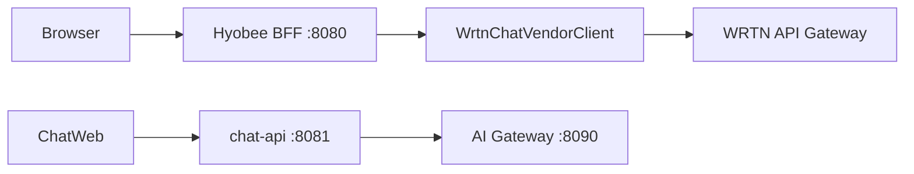

# WRTN Upstream API (역공학)

> `WrtnChatVendorClient`가 호출하는 **외부 WRTN/RAG 벤더 HTTP API** 목록·기능 분석.
>
> OpenAPI: [`packages/api-contract/wrtn-upstream-openapi.yaml`](../../packages/api-contract/wrtn-upstream-openapi.yaml)  
> Swagger UI로 보려면 [Swagger Editor](https://editor.swagger.io/)에 YAML import.

## 개요

| 항목 | 내용 |
|------|------|
| 클라이언트 | `legacy/hyobee/.../WrtnChatVendorClient.java` |
| HTTP 어댑터 | `HyobeeChatApiClient` (동기 REST + WebClient SSE) |
| Base URL | `WRTN_BASEURL` (예: `https://ax-api-gateway.wrtn.ai/hsgc-demo`) |
| 인증 | `Authorization: Bearer <JWT>` (Hyobee 세션 JWT) |
| JSON 규칙 | 대부분 **snake_case** |

Hyobee BFF(`/xs/aichat/v2/**`)·신규 chat-api(`/api/v1/**`)와 **경로는 유사**하지만, 본 문서는 **벤더 upstream** 계약입니다.



---

## API 목록 (14개 엔드포인트)

### 1. 헬스

| Method | Path | Hyobee 메서드 | 기능 |
|--------|------|---------------|------|
| GET | `/_health` | `healthCheck()` | 벤더 가용성 확인. 실패 시 Hyobee가 503 + `{error}` 반환 |

---

### 2. 대화 (Conversations)

| Method | Path | Hyobee 메서드 | 기능 |
|--------|------|---------------|------|
| GET | `/api/v1/conversations` | `selectConversations()` | 사용자 대화 목록 (page/size 페이지네이션) |
| POST | `/api/v1/conversations` | `createConversation()` | 새 대화 생성 (`user_query`로 제목·카테고리 시드) |
| DELETE | `/api/v1/conversations` | `deleteConversations()` | `conversation_ids[]` 일괄 삭제, 건별 결과 반환 |

**주요 query/body (snake_case)**

| 필드 | 용도 |
|------|------|
| `user_id` | 사용자 식별 (GET query / POST·DELETE body) |
| `page`, `size` | 목록 페이지 |
| `user_query` | 생성 시 첫 질문 |
| `chat_category` | 대화 카테고리 |
| `conversation_ids` | 삭제 대상 ID 배열 |

---

### 3. 메시지·스트리밍

| Method | Path | Hyobee 메서드 | 기능 |
|--------|------|---------------|------|
| GET | `/api/v1/conversations/{id}/messages` | `selectMessages()` | 메시지 히스토리 (cursor/size). 이미지 첨부 시 Hyobee가 `thumbnail_image` base64 보강 |
| POST | `/api/v1/conversations/{id}/ai-chat?web_search_enabled=` | `startChatStream()` | **SSE** AI 응답 스트림 |
| POST | `/api/v1/conversations/{id}/messages/{msgId}/interrupt?user_id=` | `interrupt()` | 진행 중 스트림 중단 |

#### SSE (`ai-chat`) 동작

- **Transport:** `Accept: text/event-stream`, body `application/json`
- **Query:** `web_search_enabled` (문자열, 예 `"true"`)
- **Body (`SendMessageApiRequest`):**

```json
{
  "conversation_id": "123",
  "user_id": "user01",
  "chat_category": "general",
  "message": "질문 내용",
  "files": [
    {
      "filename": "doc.pdf",
      "mime_type": "application/pdf",
      "size": 1024,
      "thumbnail_id": "uuid"
    }
  ]
}
```

- **청크 JSON (한 줄씩):**

| `status` | 의미 | 주요 필드 |
|----------|------|-----------|
| `response_chunk` | 토큰 델타 | `text` |
| `error` | upstream 오류 | `message` 또는 `error` |

Hyobee는 SSE 완료/실패 시 `ChatLogService.saveStreamApiLog`로 요청·응답·첨부 메타를 저장합니다.

#### 메시지 조회 후처리 (Hyobee 전용)

1. **썸네일 보강:** `attachments[].thumbnail_id` + 이미지 MIME → `ChatFileService.getImageByThumbnailId` → `thumbnail_image`
2. **출처 URL 정규화:** `content` 내 `[{...}]` JSON 배열을 파싱해 `DocumentLinkBuilder.resolveSourceUrl`로 `url` 재작성 (`internal` doc_type 시 `board_id` 사용)

---

### 4. 피드백

| Method | Path | Hyobee 메서드 | 기능 |
|--------|------|---------------|------|
| PUT | `/api/v1/conversations/{id}/messages/{msgId}/feedback?user_id=` | `feedback()` | like/dislike 등 피드백 upsert |
| DELETE | `/api/v1/conversations/{id}/messages/{msgId}/feedback/{feedbackId}?user_id=` | `deleteFeedback()` | 피드백 삭제 |

Body (PUT): `{ "feedback_type": "like" }`

---

### 5. 게시판 권한

| Method | Path | Hyobee 메서드 | 기능 |
|--------|------|---------------|------|
| GET | `/api/v1/boards/auth` | `selectDataBoardsAuth()` | 접근 가능 게시판 이름 목록 |

> 현재 구현은 **쿼리 파라미터 없음** (`BoardAuthApiRequest` 호출 주석 처리). 응답: `{ "content": [{ "board_name": "..." }] }`

---

### 6. R&D (v2)

| Method | Path | Hyobee 메서드 | 기능 |
|--------|------|---------------|------|
| GET | `/api/v1/conversations/{id}/messages/{msgId}/sources` | `selectMessageSources()` | AI 답변의 근거 문헌 목록 (doc_type 필터·정렬·페이지) |
| GET | `/api/v2/rnd/journal` | `selectJournals()` | 수집 저널(논문·특허·기사 등) 검색 목록 |
| GET | `/api/v2/rnd/journal/{journalId}` | `selectJournalDetail()` | 저널 상세 (특허/논문/뉴스 필드 혼재) |
| GET | `/api/v2/rnd/journal/{journalId}/related-items` | `selectJournalRelatedItems()` | 연관 문헌 |
| GET | `/api/v2/rnd/journal/{journalId}/ai-summary` | `selectJournalAiSummary()` | AI 요약 `{ intro, body, conclusion }` |

#### Hyobee → upstream 필드 매핑 (저널 목록)

| Hyobee (`JournalsRequest`) | WRTN query |
|----------------------------|------------|
| `creator` | `author` |
| `source_url` | `unique_number` |
| `journal_id` | `journal_number` |
| (고정) | `sort_by=latest` |

`selectJournals`만 **`callApiOrThrowWithViewableTeam`** — sidebar에서 선택한 팀(`JWT_TEAM_CODE`) JWT 사용.

`selectJournalDetail`은 upstream `image_url`의 `\u003d` 등 이스케이프·URL decode 후 Hyobee DTO에 설정.

---

## 인증 차이

| 호출 종류 | JWT 주입 | 팀 코드 |
|-----------|----------|---------|
| 일반 REST (대화·메시지·피드백 등) | `injectAuthorizationHeader` | 로그인 팀 (`DEPT_CODE` 등) |
| SSE `ai-chat` | `injectStreamAuthorizationHeader` | 스트림 팀 (`JWT_TEAM_CODE`) |
| GET `/api/v2/rnd/journal` | `injectStreamAuthorizationHeader` | viewable team |

---

## 오류 형식

`HyobeeChatApiClient`는 HTTP 2xx라도 body에 `{ "error": { ... } }`가 있으면 `ExternalApiException`으로 변환 (`ApiErrorResponse` / `UpstreamErrorMapper`).

---

## chat-api·AI Gateway와의 관계

| 영역 | WRTN upstream (본 문서) | chat-api / AI Gateway |
|------|-------------------------|------------------------|
| 대화 CRUD | `/api/v1/conversations/**` | chat-api 동일 경로 (JPA) |
| 스트리밍 | `/api/v1/.../ai-chat` SSE | `POST /v1/completions` SSE |
| R&D 저널 | `/api/v2/rnd/**` | (미이관) |
| Health | `/_health` | `/_health` |

현대화 Phase에서는 RAG 호출을 **katsulabs-ai-gateway**로 대체 중. WRTN upstream 전체를 1:1 이식하지 않고, [`docs/rag-external-client.md`](../rag-external-client.md) 계약을 우선합니다.

---

## Swagger / OpenAPI 사용

```bash
# YAML 경로
packages/api-contract/wrtn-upstream-openapi.yaml

# 로컬에서 미리보기 (redoc-cli 등)
npx @redocly/cli preview-docs packages/api-contract/wrtn-upstream-openapi.yaml
```

신규 BFF 계약(chat-api ↔ browser)은 [`packages/api-contract/openapi.yaml`](../../packages/api-contract/openapi.yaml)을 사용하세요.

## 참고

- [wrtn-to-ai-gateway-handoff.md](./wrtn-to-ai-gateway-handoff.md) — **Gateway repo 전달용** (OpenAPI·프롬프트·완료 기준)
- [wrtn-to-ai-gateway-prompt.md](./wrtn-to-ai-gateway-prompt.md) — 복붙 프롬프트

---

## 근거 코드

| 파일 | 역할 |
|------|------|
| `WrtnChatVendorClient.java` | upstream URL·메서드 매핑 |
| `WrtnRequestMapper.java` | internal → WRTN request DTO |
| `HyobeeChatApiClient.java` | HTTP/SSE, JWT, 로깅 |
| `dto/external/wrtn/**` | upstream request/response DTO |

외부 헬스 스모크: `WrtnExternalApiHealthCheckTest` (`RUN_EXTERNAL_API_TESTS=true`)
