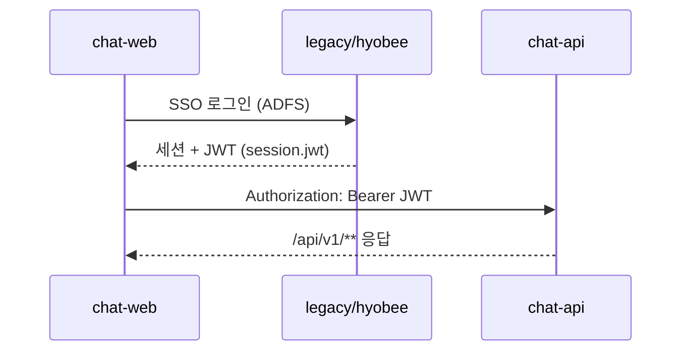

# Auth 브릿지 — 레거시 SSO/JWT ↔ chat-api

> **Phase 1:** 브라우저는 레거시에서 로그인하고, chat-api는 **Bearer JWT**로 사용자를 식별한다.  
> **Phase 2:** Reverse proxy·세션 공유·레거시 `auth/verify` 연동을 강화한다.

## 흐름 (MVP)



| 단계 | 주체 | 동작 |
|------|------|------|
| 1 | 사용자 | 레거시 `login.jsp` / ADFS SSO로 로그인 |
| 2 | legacy | `HyobeeJwtTokenService`로 JWT 발급, 세션 `jwt` 속성 저장 |
| 3 | chat-web | JWT를 `localStorage` 또는 쿠키 브릿지로 보관 (Phase 1: 수동·dev 토큰 가능) |
| 4 | chat-api | `Authorization: Bearer <JWT>` 검증 후 Use Case 실행 |

## 레거시 참고

| 항목 | 레거시 |
|------|--------|
| 인터셉터 | `HyobeeApiInterceptor` — `/xs/aichat/**` |
| JWT 검증 | `HyobeeJwtTokenService.validateToken` |
| 스모크 | `GET /xs/vob/aichat/auth/verify` + `Authorization: Bearer` |
| 클레임 | `sub`(userId), `corpCode`, `pgCode`, `puCode`, `teamCode` |

chat-api는 **동일 SECRET_KEY·클레임 구조**를 재사용하거나, Phase 2에서 legacy `auth/verify`를 호출해 위임한다.

## chat-api (Phase 1)

| 설정 | 기본 | 설명 |
|------|------|------|
| `katsubot.auth.dev-bypass` | `true` (로컬) | `true` 시 `Bearer dev-token` 허용 |
| `katsubot.auth.jwt-secret` | (없음) | 레거시 `SECRET_KEY` **UTF-8 문자열** — HMAC **HS512** 검증 |
| `SPRING_PROFILES_ACTIVE` | `in-memory` | `jpa` 시 Postgres + Flyway V1 영속화 |

### JWT 알고리즘 (레거시 호환)

- 서명: **HS512**
- 키: `SECRET_KEY` 프로퍼티 값의 **UTF-8 바이트** (`Keys.hmacShaKeyFor`)
- 클레임: `sub`(userId), `corpCode`, `teamCode` (선택: `pgCode`, `puCode`)

### HTTP 계약

```http
GET /api/v1/conversations
Authorization: Bearer <JWT>
```

| 상태 | 조건 |
|------|------|
| **401** | `Authorization` 헤더 없음, `Bearer` 형식 아님, 토큰 무효 |
| **403** | (Phase 2) 대화 소유자 불일치 |
| **200** | 유효 토큰 |

에러 본문: OpenAPI `ErrorResponse` (`code`, `message`).

## chat-web (Phase 1)

| 환경 | JWT 획득 |
|------|----------|
| 로컬 개발 | `VITE_AUTH_TOKEN=dev-token` + `katsubot.auth.dev-bypass=true` |
| 통합 | 레거시 로그인 후 JWT를 앱에 전달 (redirect query·postMessage — Phase 2) |

```typescript
// apps/chat-web — API 호출 시
headers: { Authorization: `Bearer ${getAuthToken()}` }
```

## Phase 2 예정

- Nginx: `/api/v1/**` → chat-api, `/xs/**` SSO → legacy
- 세션 쿠키 공유 또는 `auth/verify` 프록시
- `board-auth` 권한 Port

## 관련 문서

- [packages/api-contract/openapi.yaml](../packages/api-contract/openapi.yaml)
- [KC-007-modernization-plan.md](./KC-007-modernization-plan.md) Phase 1
- [rag-external-client.md](./rag-external-client.md) — RAG는 별도 서비스 (인증 무관)
