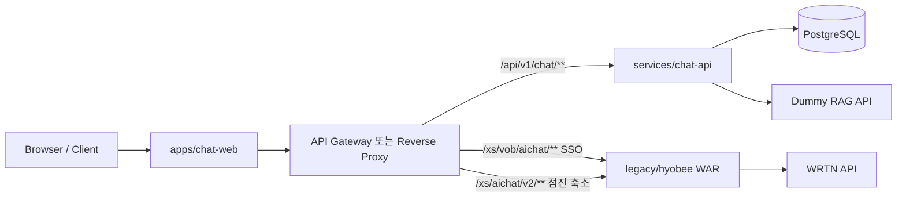

# KC-007-modernization — 프로젝트 구조 결정안

| 항목 | 값 |
|------|-----|
| 티켓 | KC-007-modernization |
| 상태 | **승인 대기** |
| 의사결정 | 모노레포 vs 멀티레포, 모듈 경계 |

## 1. 현황 (As-Is)

```text
katsulabs-chatbot-api/
├── pom.xml                    # Spring Boot 2.7.18, Java 21, Maven, WAR
├── src/main/java/xs/          # 단일 패키지 트리
│   ├── aichat/v2/**           # 채팅 API (WRTN 연동, SSE)
│   ├── webbase/login/**       # 로그인
│   ├── core/**                # 인터셉터, 세션, 공통
│   └── vob/**                 # 레거시 VOB
├── src/main/webapp/**         # JSP (login.jsp, main.jsp)
└── docs/harness/**            # Agent 협업·워크플로
```

**특징**

- 단일 WAR 배포, 외장 Tomcat 9.x 제약 (in-place Boot 3+ 마이그레이션 불가)
- 프론트: JSP + IIFE JS (`aichat010.js`, TB-004 모듈화 진행 중)
- 백엔드: 레이어드 MVC + Service, Clean Architecture 미적용
- 외부 LLM: WRTN API (`HyobeeChatApiClient`, SSE `/xs/aichat/v2/stream/**`)

## 2. 목표 (To-Be)

| 영역 | 목표 |
|------|------|
| Frontend | React SPA (또는 Vite + React), SSE 스트리밍 UI |
| Backend | Spring Boot 4.1, JDK 25, Gradle, Clean Architecture |
| 데이터 | PostgreSQL (기존 DB 스키마 점진 이관 또는 신규 스키마) |
| RAG | Dummy RAG API → 이후 Agentic RAG/벤더 교체 가능 |
| 레거시 | 운영 중단 없이 Strangler Fig로 트래픽 이전 |

## 3. 구조안 비교

### 구조안 A — 멀티레포 (frontend / backend / legacy 각각)

```text
katsulabs-chatbot-web/     # React
katsulabs-chatbot-api/     # Boot 4.1 (신규만)
katsulabs-hyobee-legacy/   # 기존 WAR (또는 현 repo rename)
```

| 장점 | 단점 |
|------|------|
| 팀·권한·릴리스 주기 완전 분리 | API 계약·버전 동기화 비용 ↑ |
| 신규 repo에 깨끗한 히스토리 | 하네스 문서·CI·worktree 규칙 이중 운영 |
| 레거시 빌드와 신규 빌드 완전 격리 | Strangler 라우팅·통합 테스트 오케스트레이션 복잡 |

**적합한 경우:** 프론트·백엔드·레거시를 **서로 다른 팀**이 독립 배포하고, API 계약을 OpenAPI + 별도 Contract repo로 관리할 때.

---

### 구조안 B — 모노레포 + Gradle 멀티모듈 (권장)

```text
katsulabs-chatbot-api/
├── settings.gradle.kts
├── legacy/
│   └── hyobee/                 # 기존 Maven WAR (pom.xml 유지 또는 Gradle 래핑)
├── services/
│   └── chat-api/               # Boot 4.1, JDK 25, Clean Architecture
├── apps/
│   └── chat-web/               # React (Vite)
├── packages/
│   └── api-contract/           # OpenAPI 생성 타입·공유 DTO (선택)
├── infra/
│   └── docker-compose.yml      # Postgres, dummy-rag
├── .github/workflows/
│   ├── legacy-ci.yml
│   ├── chat-api-ci.yml
│   └── chat-web-ci.yml
└── docs/
    ├── harness/                # KC-000 · 운영 워크플로
    └── modernization/          # KC-007-modernization
```

| 장점 | 단점 |
|------|------|
| 단일 PR로 계약·구현·문서 동기화 | repo 크기·CI 시간 증가 (경로 필터로 완화) |
| Strangler 라우팅·feature flag를 한 곳에서 관리 | 레거시 Maven + 신규 Gradle 이중 빌드 |
| 기존 harness·worktree 규칙 확장 용이 | 모듈 경계 위반 시 결합도 재증가 위험 |

**적합한 경우:** 동일 제품(효성 AI 챗봇)의 **점진 이전**이 목표이고, Contract/QA 하네스를 유지할 때. **현 프로젝트에 가장 부합.**

---

### 구조안 C — 모노레포 단일 Gradle (레거시 전면 이전)

기존 `src/`를 Gradle 서브모듈로 **한 번에** 이전하고 Boot 4.1으로 올리는 방식.

| 장점 | 단점 |
|------|------|
| 빌드 도구 단일화 | `javax.*` → `jakarta.*`, Tomcat 10+, 전 패키지 마이그레이션 **Big Bang** |
| | 외장 Tomcat 9.x / `javax.*` 제약과 충돌 |
| | 인증 59건 회귀·JSP 전면 교체가 동시에 필요 → 리스크 극대 |

**판단:** ❌ **비권장** — 운영 연속성 목표와 레거시 배포 제약에 부합하지 않음.

## 4. 권장안: 구조안 B 상세

### 4.1 모듈 책임

| 모듈 | 빌드 | 런타임 | 책임 |
|------|------|--------|------|
| `legacy/hyobee` | Maven (`mvn`) | WAR @ Tomcat 9 | 기존 SSO·JSP·v2 API 유지 |
| `services/chat-api` | Gradle | JAR @ Boot 4 embedded | 신규 REST/SSE, Auth 어댑터, RAG Port |
| `apps/chat-web` | npm/pnpm | 정적 또는 Nginx | React 채팅 UI |
| `packages/api-contract` | Gradle/npm | — | OpenAPI 스키마·클라이언트 생성 (Phase 1+) |

### 4.2 Clean Architecture (chat-api)

```text
services/chat-api/src/main/java/.../
├── domain/           # Entity, Domain Service, Port (interface)
├── application/      # Use Case (Interactor), DTO
├── infrastructure/   # JPA, WebClient, DummyRagAdapter, LegacyAuthBridge
└── interfaces/       # REST Controller, SSE, Exception Handler
```

**의존성 규칙:** `interfaces` → `application` → `domain` ← `infrastructure` (domain은 프레임워크 무의존)

### 4.3 Strangler 라우팅 (전환기)



- **Phase 0–1:** 신규 UI는 `chat-web` → `chat-api`만 사용; SSO는 레거시 redirect 유지
- **Phase 2:** 대화 CRUD를 `chat-api`로 이전, 레거시 v2는 read-only 또는 proxy
- **Phase 3:** WRTN/Dummy RAG를 Port 뒤로 통합; 레거시 WAR 축소

### 4.4 레거시 Maven 유지 vs Gradle 통합

| 옵션 | 설명 | 권장 |
|------|------|------|
| B-1 | `legacy/hyobee`에 `pom.xml` 그대로, 루트는 Gradle composite만 | ✅ Phase 0 |
| B-2 | 레거시도 Gradle `war` 플러그인으로 이전 | Phase 4+ (선택) |

Phase 0에서는 **B-1**로 이전 비용을 최소화한다.

## 5. 멀티레포가 나은 예외 조건

다음이 **모두** 해당되면 구조안 A 재검토:

1. 신규 챗봇이 **별도 제품/도메인**(다른 고객·SLA)이다.
2. 레거시 Hyobee는 **동결**(feature freeze)이고 신규만 개발한다.
3. 조직적으로 frontend/backend **독립 배포 파이프라인**이 필수다.

현 요구사항(「legacy를 별도 모듈로 나눈다」)은 **같은 제품의 모듈 분리**에 가깝기 때문에 B가 적합하다.

## 6. 의사결정 요청

| ID | 선택지 | 권장 |
|----|--------|------|
| **STRUCT-1** | A: 멀티레포 | |
| **STRUCT-2** | **B: 모노레포 멀티모듈** | ✅ |
| **STRUCT-3** | C: 단일 Gradle Big Bang | ❌ |

승인 시 `KC-007-work-plan.md` Phase 0 착수 조건으로 기록한다.
