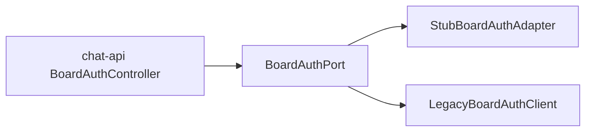

# Board Auth 브릿지 — 레거시 `board-auth` ↔ chat-api

> **Phase 2:** 내부 게시판 접근 권한 목록을 `BoardAuthPort`로 추상화하고, 전환기에는 레거시 WRTN/DB 브릿지를 사용한다.

## 레거시 (As-Is)

| 항목 | 값 |
|------|-----|
| 엔드포인트 | `GET /xs/aichat/v2/board-auth` |
| 컨트롤러 | `HyobeeChatController.selectDataBoardsAuth` |
| 응답 | `BoardAuthResponse` — `content[]` with `board_name` |

레거시는 WRTN API를 호출해 사용자가 접근 가능한 데이터 보드 목록을 반환한다.

## 신규 (To-Be)

| 항목 | 값 |
|------|-----|
| OpenAPI | `GET /api/v1/board-auth` |
| Port | `com.katsulabs.chatbot.domain.port.BoardAuthPort` |
| 응답 | `BoardAuthPage` — `items[].board_name` |



## Port 계약

```java
public interface BoardAuthPort {
    BoardAuthPage listAccessibleBoards(String userId, int page, int size);
}
```

| 프로필 | Adapter | 동작 |
|--------|---------|------|
| `in-memory` (기본) | `StubBoardAuthAdapter` | 빈 목록 또는 로컬 샘플 |
| `legacy-bridge` (선택) | `LegacyBoardAuthClient` | 레거시 HTTP 프록시 |

## 레거시 브릿지 (선택 프로필)

환경 변수:

| 변수 | 설명 |
|------|------|
| `KATSUBOT_LEGACY_BASE_URL` | 예: `http://localhost:8080` |
| `KATSUBOT_LEGACY_BOARD_AUTH_PATH` | 기본 `/xs/aichat/v2/board-auth` |

브릿지 호출 시 레거시 세션·JWT가 필요할 수 있다. 스테이징에서는 reverse proxy 뒤 동일 도메인 쿠키 공유를 권장한다 (`docs/harness/phase2-proxy-smoke.md` — QA 산출물).

## 인증

- chat-api: Bearer JWT (`sub` = userId)
- 레거시 대조 시 `user_id` 쿼리는 **사용하지 않음** — JWT만 신뢰

## Phase 3+

- RAG 서비스 또는 사내 ACL DB로 직접 조회
- `BoardAuthPort` 구현체만 교체; OpenAPI·Controller 유지
