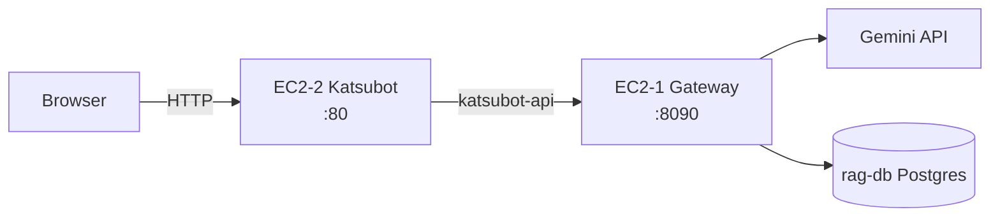

# POC EC2 배포 (2대)

> **용도:** POC·데모 — 종료 시 EC2 terminate + `./scripts/poc/teardown-ec2.sh all`  
> **범위:** katsubot-web + katsubot-api + AI Gateway (레거시 Hyobee·SSO 없음)

## 아키텍처



| EC2 | 역할 | compose | 공개 포트 |
|-----|------|---------|-----------|
| **EC2-1** | AI Gateway + WRTN DB | `infra/poc-ec2/docker-compose.gateway-ec2.yml` | 8090 (EC2-2 SG만) |
| **EC2-2** | nginx SPA + katsubot-api | `infra/poc-ec2/docker-compose.katsubot-ec2.yml` | 80 (데모용) |

## DB — 별도 RDS 필요 없음 (POC)

채팅·대화 데이터는 **EC2-1의 Docker Postgres(`rag-db`)** 에 저장됩니다. `deploy-gateway-ec2.sh` 실행 시 compose가 DB 컨테이너를 함께 띄우고, Gateway Flyway가 스키마를 만듭니다.

| DB | POC 필요? | 어디서? | AWS RDS? |
|----|-----------|---------|----------|
| **WRTN / Gateway DB** (`wrtn`) | **필수** | EC2-1 `rag-db` 컨테이너 | **불필요** |
| **katsubot-api 전용 Postgres** | 불필요 | `gateway` 프로필은 Gateway에 위임 | 불필요 |
| **hyobee-admin-db** (`com_user` 로그인) | 불필요 | Dev JWT bypass 사용 | 불필요 |

EC2-1 `.env`에 **`RAG_DB_PASSWORD`만** 정하면 됩니다 (compose가 Postgres 비밀번호 + Gateway `SPRING_DATASOURCE_*`에 자동 반영).

```bash
# EC2-1 infra/poc-ec2/.env
RAG_DB_PASSWORD=your-strong-poc-password
GATEWAY_FLYWAY_ENABLED=true   # 기본값 — 최초 기동 시 테이블 생성
```

EC2-2(`katsubot-api`)는 `SPRING_PROFILES_ACTIVE=gateway` 이라 **자체 DB 없이** EC2-1 Gateway API로 대화·메시지를 읽고 씁니다.

> 운영·SSO 로그인 POC 확장 시에만 hyobee-admin-db(RDS 또는 기존 Hyobee DB) 연결이 필요합니다. 현재 POC 범위 밖.

## AWS 사전 준비

> **처음이면:** [poc-ec2-aws-setup.md](./poc-ec2-aws-setup.md) — 콘솔 클릭 순서·CLI 자동화

### 인스턴스

| 항목 | 권장 |
|------|------|
| AMI | Amazon Linux 2023 또는 Ubuntu 22.04 |
| 타입 | `t3.medium` (POC) |
| 디스크 | 30GB gp3 |
| VPC | 동일 VPC·서브넷 (또는 피어링) |

### Security Group

**EC2-1 (gateway-sg)**

| 방향 | 포트 | 소스 |
|------|------|------|
| Inbound | 8090 | EC2-2 private IP / katsubot-sg |
| Inbound | 22 | 관리 IP (VPN) |
| Outbound | 443 | 0.0.0.0/0 (Gemini API) |

**EC2-2 (katsubot-sg)**

| 방향 | 포트 | 소스 |
|------|------|------|
| Inbound | 80 | 데모 접속 IP (또는 0.0.0.0/0 — POC 한정) |
| Inbound | 22 | 관리 IP |
| Outbound | 8090 | EC2-1 private IP |
| Outbound | 443 | 0.0.0.0/0 |

### Secrets (git 커밋 금지)

| 변수 | EC2 | 설명 |
|------|-----|------|
| `RAG_DB_PASSWORD` | 1 | WRTN Postgres |
| `GATEWAY_JWT_SECRET` / `HYOBEE_JWT_SECRET` | 1·2 | **동일 값** (HS512) |
| `LLM_API_KEY` | 1 | Google AI API key |
| `RAG_SERVICE_BASE_URL` | 2 | `http://<EC2-1-private-ip>:8090` |

## 배포 절차

### 0. 공통 (양 EC2)

```bash
git clone https://github.com/katsulabs/katsulabs-katsubot.git
cd katsulabs-katsubot
chmod +x scripts/poc/*.sh
./scripts/poc/ec2-prereq.sh
# docker 그룹 적용: logout/login 또는 newgrp docker
```

### 1. EC2-1 — Gateway

```bash
git clone https://github.com/katsulabs/katsulabs-ai-gateway.git ~/katsulabs-ai-gateway

cp infra/poc-ec2/.env.gateway.example infra/poc-ec2/.env
# AI_GATEWAY_REPO, RAG_DB_PASSWORD, GATEWAY_JWT_SECRET, LLM_API_KEY 편집

./scripts/poc/deploy-gateway-ec2.sh
curl -s http://127.0.0.1:8090/_health
```

EC2-1 **private IP** 기록 (예: `10.0.1.10`).

### 2. EC2-2 — Katsubot

```bash
git clone https://github.com/katsulabs/katsulabs-katsubot.git
cd katsulabs-katsubot

cp infra/poc-ec2/.env.katsubot.example infra/poc-ec2/.env
# RAG_SERVICE_BASE_URL=http://<EC2-1-private-ip>:8090
# HYOBEE_JWT_SECRET — EC2-1 과 동일

./scripts/poc/deploy-katsubot-ec2.sh
./scripts/poc/smoke-poc-ec2.sh
```

### 3. 브라우저 접속

1. `http://<EC2-2-public-ip>/` — React SPA
2. Dev JWT: 배포 스크립트 출력 또는  
   `./scripts/mint-hyobee-dev-jwt.sh infra/poc-ec2/.env`
3. URL handoff: `http://<EC2-2-public-ip>/?jwt=<token>`

## 검증

```bash
# EC2-2에서
./scripts/poc/smoke-poc-ec2.sh

# 수동
curl -s http://<EC2-2>/healthz
curl -s -H "Authorization: Bearer <jwt>" http://<EC2-2>/api/v1/conversations
```

## 종료 (POC teardown)

```bash
# EC2-2
./scripts/poc/teardown-ec2.sh katsubot

# EC2-1
./scripts/poc/teardown-ec2.sh gateway

# AWS — 인스턴스·EBS·Elastic IP 해제
aws ec2 terminate-instances --instance-ids i-xxx i-yyy
```

## 트러블슈팅

| 증상 | 확인 |
|------|------|
| Gateway health fail | `docker compose -f infra/poc-ec2/docker-compose.gateway-ec2.yml logs ai-gateway` |
| EC2-2 → Gateway 연결 거부 | SG 8090, `RAG_SERVICE_BASE_URL` private IP |
| 401 on /api/v1 | JWT secret EC2-1·2 일치, `?jwt=` 또는 Bearer |
| SSE timeout | `LLM_API_KEY`·Gemini quota, Gateway logs |
| Flyway 오류 | `GATEWAY_FLYWAY_ENABLED=true`, rag-db 볼륨 초기화 후 재기동 |

## 관련

- [09-operations-runbook.md](./09-operations-runbook.md) — 운영·Secrets
- [04-local-development.md](./04-local-development.md) — 로컬 동일 스택
- [08-ai-gateway-handoff.md](./08-ai-gateway-handoff.md) — Gateway 계약
