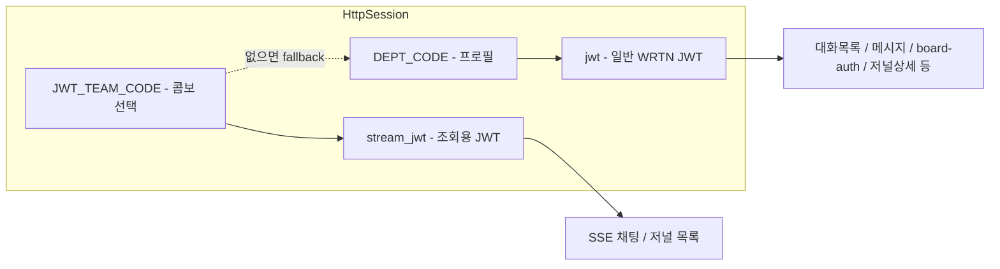

# 다중 권한(team_code) 조회 기능

> 브랜치: `rnd/server/multiple-authorities`  
> 목적: 다중 권한 사용자가 sidebar select box에서 팀(`dept_code` / `team_code`)을 선택해, 해당 팀 기준으로 AI 채팅·RND 저널 목록을 조회할 수 있게 한다.

---

## 1. 기능 개요

| 항목 | 설명 |
|------|------|
| 대상 사용자 | `chat_viewable_teams`에 등록된 **다중 권한** 보유자 |
| UI | sidebar `#viewable_team_code` 콤보 (다중 권한일 때만 노출) |
| 적용 범위 | SSE 채팅 메시지 전송, RND 저널 **목록** 조회 |
| team 전달 방식 | WRTN API query param이 아닌 **JWT `teamCode` claim** |

핵심 설계는 **프로필 소속(`DEPT_CODE`)** 과 **조회용 팀(`JWT_TEAM_CODE`)** 을 분리하는 것이다.

---

## 2. JWT / 세션 구조

WRTN API에는 `team_code`를 body/query로 보내지 않고, `Authorization: Bearer {JWT}` 의 **`teamCode` claim**으로 팀이 전달된다.

| 세션 키 | 의미 | JWT 캐시 키 | `teamCode` claim |
|--------|------|------------|------------------|
| `DEPT_CODE` | 로그인 사용자 **본인 소속** (프로필) | `jwt` | 로그인 `DEPT_CODE` |
| `JWT_TEAM_CODE` | sidebar **콤보 선택 조회 팀** | `stream_jwt` | 선택한 `team_code` |



### 콤보 변경 시 (`PUT /xs/aichat/v2/session/jwt-team-code`)

1. `chat_viewable_teams` 기준 권한 검증 (`assertViewableTeam`)
2. 세션 `JWT_TEAM_CODE` 저장
3. `stream_jwt`만 삭제 → 다음 SSE/저널 호출 시 새 JWT 재발급
4. **`DEPT_CODE`, `jwt`(일반 JWT)는 유지** → 프로필·일반 API에 영향 없음

---

## 3. API 목록

### Hyobee 내부 API

| Method | Path | 설명 |
|--------|------|------|
| `GET` | `/xs/aichat/v2/rnd/viewable-teams` | 사용자별 조회 가능 팀 목록 |
| `PUT` | `/xs/aichat/v2/session/jwt-team-code` | 콤보 선택 team → `JWT_TEAM_CODE` 갱신 |

**`jwt-team-code` 요청 body**

```json
{ "code": "74J47" }
```

### WRTN 연동 — 조회용 JWT (`JWT_TEAM_CODE` / `stream_jwt`)

| 기능 | Hyobee 경로 | WRTN 경로 |
|------|------------|-----------|
| SSE 채팅 | `POST /stream/sendMessageParam` → `GET /stream/message` | `/api/v1/conversations/{id}/ai-chat` |
| 저널 목록 | `GET /xs/aichat/v2/rnd/journals` | `/api/v2/rnd/journal` |

### WRTN 연동 — 로그인 JWT (`DEPT_CODE` / `jwt`) — 변경 없음

| 기능 | 예시 |
|------|------|
| 대화/메시지 CRUD | `/conversations`, `/messages` |
| 게시판 권한 | `/board-auth` |
| 저널 상세/연관/AI요약 | `/journal/{id}`, `/related-items`, `/ai-summary` |
| 인터셉터 | `HyobeeApiInterceptor` — 모든 `/xs/aichat/**` 요청의 세션 JWT 갱신 |

---

## 4. UI 동작

```
viewable-teams API
       │
       ├─ 0건 → 서버에서 본인 team 1개 fallback
       │
       ├─ 1건 & code === 본인 DEPT_CODE
       │      → .owner / .cell 숨김 (콤보·로그아웃 영역 invisible)
       │
       └─ 2건 이상 (또는 1건이지만 타 팀)
              → select box 노출
              → 변경 시 PUT jwt-team-code
              → 저널 화면 열려 있으면 목록 재조회
```

| DOM | 역할 |
|-----|------|
| `#viewable_team_code` | 조회 팀 콤보 |
| `#team_code` (hidden) | 초기값 = 세션 `DEPT_CODE`, 콤보 fallback용 |
| `.owner` / `.cell` | 콤보 + 로그아웃 영역 |

---

## 5. 처리 흐름

### 페이지 로드

```
setUserParams()
  → #team_code = 세션 DEPT_CODE

loadViewableTeamsCombo()
  → GET /rnd/viewable-teams
  → 콤보 draw
  → applyViewableTeamSelection(현재 team)
  → updateViewableTeamOwnerVisibility() — 단일 본인 team이면 UI 숨김
```

### 채팅 전송

```
selectDataChatStream()
  → syncViewableTeamBeforeStream()
       → PUT /session/jwt-team-code { code: 콤보값 }
  → POST /stream/sendMessageParam
  → EventSource /stream/message
       → WRTN Authorization: stream_jwt (teamCode = 콤보)
```

### 저널 목록 조회

```
journal.selectData()
  → syncViewableTeamBeforeStream()
  → GET /rnd/journals
       → WRTN Authorization: stream_jwt (teamCode = 콤보)
```

### 추천 저널 (hidden_chat)

- `embedViewTeamAfterHiddenChatMessage()` — 메시지에 `view_team` 마커 삽입
- `getSelectedViewableTeamCode()` / `getSelectedViewableTeamName()` — 선택 팀 반영

---

## 6. DB / 권한

### `chat_viewable_teams`

- `user_id`별 조회 가능 `dept_code` (team_code) 매핑
- `is_active = true` 인 행만 조회

### 권한 검증 (`ChatSessionServiceImpl.assertViewableTeam`)

| 조건 | 동작 |
|------|------|
| viewable 목록 **있음** | 목록에 `teamCode` 포함 여부 확인 |
| viewable 목록 **없음** | 본인 `User.teamCode`와 일치하는지만 허용 |
| 미허용 team | `403 조회 권한이 없는 팀입니다.` |

### viewable-teams fallback

`RndChatServiceImpl.selectViewableTeams` — DB 목록이 비어 있으면 **본인 team 1개**를 응답에 추가.

---

## 7. 주요 소스 파일

### 백엔드

| 파일 | 역할 |
|------|------|
| `AichatSessionKeys` | `JWT_TEAM_CODE`, `JWT`, `STREAM_JWT` |
| `JwtSessionHelper` | 팀 코드 resolve, JWT 발급·캐시·claim 검증 |
| `ChatSessionServiceImpl` | `JWT_TEAM_CODE` 갱신 + 권한 검증 |
| `HyobeeChatController` | `PUT /session/jwt-team-code` |
| `HyobeeRndController` | `GET /viewable-teams`, `GET /journals` |
| `XtrmAichatInterface` | `injectAuthorizationHeader`, `injectStreamAuthorizationHeader`, `callApiOrThrowWithViewableTeam` |
| `WrtnChatVendorClient` | SSE → stream JWT, 저널 목록 → viewable team JWT |
| `HyobeeApiInterceptor` | 일반 JWT(`jwt`) 발급/갱신 |
| `UserMapper.xml` | `findViewableTeamsById`, `findById` |

### 프론트엔드

| 파일 | 역할 |
|------|------|
| `sidebar.jsp` | `#viewable_team_code` 콤보 영역 |
| `aichat010.js` | 콤보 로드, team sync, SSE 전 동기화, UI visibility |
| `journal.js` | 저널 목록 조회 전 team sync |

---

## 8. 커밋 이력 (브랜치)

| 커밋 | 내용 |
|------|------|
| `0b78c0a7` | viewable-teams API, Team DTO, sidebar 콤보, UserMapper |
| `67c7aa55` | JWT 분리, jwt-team-code API, SSE 채팅 시 선택 team 반영 |
| *(uncommitted)* | 저널 목록 viewable team JWT, 단일 권한 UI 숨김, `is_active` 필터 |

---

## 9. 미적용 / 추후 검토

| 항목 | 현재 상태 |
|------|-----------|
| 저널 상세 `/journal/{id}` | 로그인 `DEPT_CODE` JWT |
| 저널 연관 `/related-items` | 로그인 `DEPT_CODE` JWT |
| 저널 AI요약 `/ai-summary` | 로그인 `DEPT_CODE` JWT |
| 채팅 요청 body | `team_code` 필드 없음 (JWT만 사용) |

다중 권한 사용자가 저널 **상세**까지 타 팀 기준으로 봐야 한다면, 해당 API도 `callApiOrThrowWithViewableTeam` 패턴으로 확장 필요.

---

## 10. 한 줄 요약

> 프로필 팀(`DEPT_CODE`)과 조회 팀(`JWT_TEAM_CODE`)을 JWT 2종(`jwt` / `stream_jwt`)으로 분리하고, sidebar 콤보로 조회 팀을 바꾼 뒤 **SSE 채팅·저널 목록**에만 선택 team을 WRTN JWT claim으로 넘긴다. 다중 권한자에게만 콤보를 보여주고, 본인 team 1개면 UI를 숨긴다.
