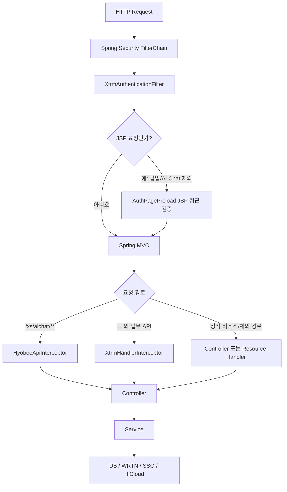
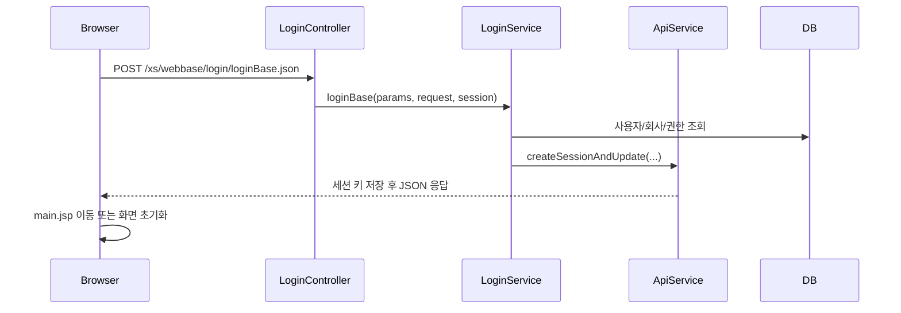
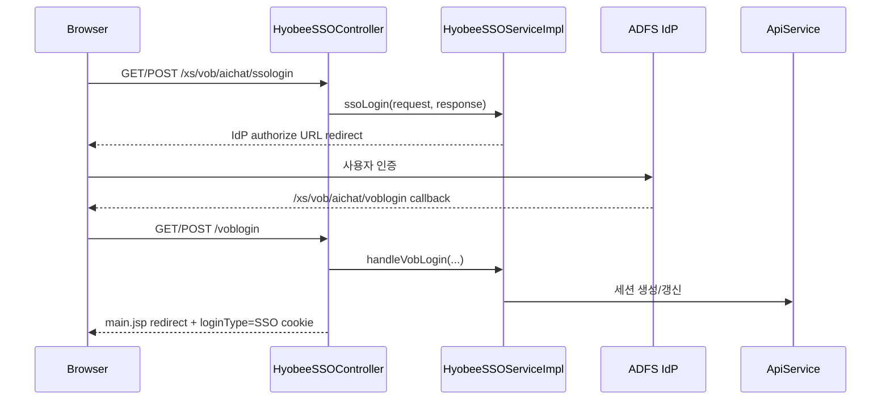
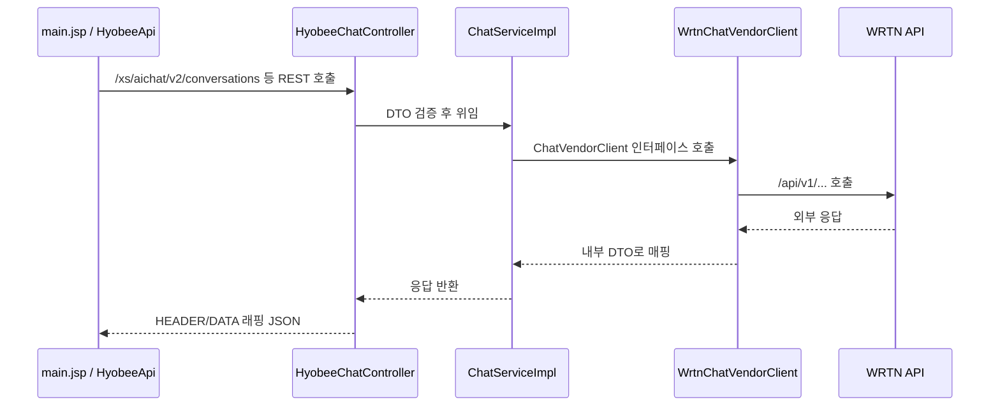
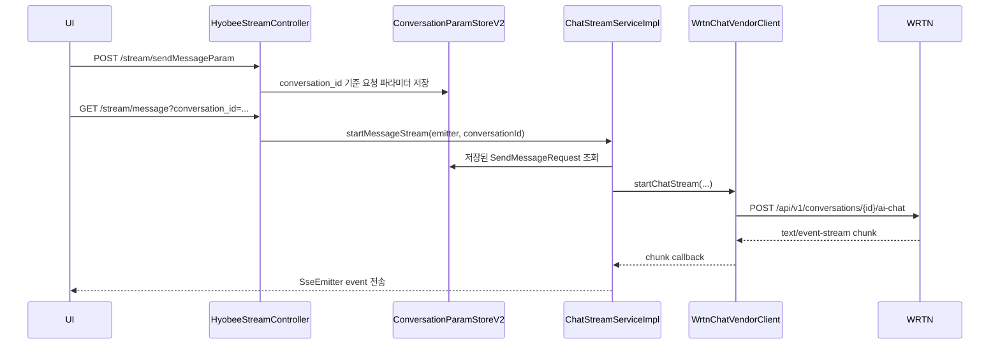

# Hyobee (Legacy)

> **모노레포 위치:** `legacy/hyobee/` — 신규 UX는 [katsubot-web](../../apps/katsubot-web) + [katsubot-api](../../services/katsubot-api). 전환 정책: [DEPRECATED.md](./DEPRECATED.md). 저장소 루트 개요: [README.md](../../README.md).

Hyobee는 효성 그룹웨어 환경에서 동작하는 AI 챗봇 웹 애플리케이션입니다. Spring Boot 기반의 레거시 VOB/Xtrm 공통 프레임워크 위에 Hyobee v2 REST API, SSE 스트리밍, SSO, 파일 첨부, RND 저널 조회 기능을 얹은 구조입니다.

이 문서는 처음 프로젝트를 받는 개발자가 로컬 환경 설정부터 주요 요청 흐름까지 빠르게 파악할 수 있도록 저장소 구조, 실행 방법, 설정 포인트, 인증/채팅 플로우를 함께 설명합니다.

## 목차

- [1. 프로젝트 개요](#1-프로젝트-개요)
- [2. 기술 스택](#2-기술-스택)
- [3. 디렉터리 구조](#3-디렉터리-구조)
- [4. 환경 설정](#4-환경-설정)
- [5. 빌드와 실행](#5-빌드와-실행)
- [6. 애플리케이션 요청 흐름](#6-애플리케이션-요청-흐름)
- [7. 주요 API](#7-주요-api)
- [8. 화면과 정적 리소스](#8-화면과-정적-리소스)
- [9. 데이터베이스와 파일 저장소](#9-데이터베이스와-파일-저장소)
- [10. 테스트와 검증](#10-테스트와-검증)
- [11. 운영 주의사항](#11-운영-주의사항)
- [12. 참고 문서](#12-참고-문서)

## 1. 프로젝트 개요

| 항목 | 내용 |
| --- | --- |
| 애플리케이션 | Hyobee AI Chat v2 |
| Maven 좌표 | `xs.webbase:hyobee:2.0.0` |
| 패키징 | WAR |
| 진입점 | `src/main/java/xs/XtrmMainApplication.java` |
| 기본 포트 | `8080` |
| 기본 Spring profile | `local` |
| 주요 외부 연동 | PostgreSQL, WRTN AI Gateway, ADFS SSO, HiCloud, Callisto, 메일/SMS 인증 서버 |

`XtrmMainApplication`은 `@SpringBootApplication(scanBasePackages = "xs")`로 전체 `xs.*` 패키지를 스캔하며, 비동기 처리, 스케줄링, 트랜잭션, Spring Retry를 활성화합니다. `SpringBootServletInitializer`를 상속하므로 실행형 WAR와 외부 WAS 배포를 모두 염두에 둔 구조입니다.

## 2. 기술 스택

### Backend

- Java 11
- Spring Boot 2.7.18
- Spring MVC / Spring Security / Spring Validation
- Spring WebFlux `WebClient`
- Spring Retry, Scheduling, Async
- MyBatis 2.3.2
- PostgreSQL JDBC
- Tomcat JDBC Pool
- Log4j2
- Lombok
- JJWT 0.12.x
- Apache HttpClient 4.x/5.x
- Apache POI

### Frontend

- JSP / JSTL
- XUI 공통 프레임워크
- jQuery
- DHTMLX Grid
- Markdown/Code/수식 렌더링용 내장 라이브러리
- Hyobee v2 JavaScript 모듈

### Build

- Maven
- `spring-boot-maven-plugin`
- `maven-war-plugin`
- `maven-dependency-plugin`
- `maven-assembly-plugin`

## 3. 디렉터리 구조

```text
legacy/hyobee/
├── pom.xml
├── README.md
├── docs/
│   └── harness/                    # 인증/QA/작업 범위 등 운영 문서
└── src/
    ├── main/
    │   ├── java/xs/
    │   │   ├── XtrmMainApplication.java
    │   │   ├── aichat/              # Hyobee SSO/JWT 및 v2 AI Chat
    │   │   ├── core/                # Xtrm 공통 설정, DAO, 인터셉터, 유틸
    │   │   ├── domain/              # 공통 도메인 API
    │   │   ├── system/              # 시스템 enum
    │   │   ├── vob/                 # VOB 레거시 관리/공통 기능
    │   │   └── webbase/             # 로그인, 홈, 파일 다운로드 등
    │   ├── resources/
    │   │   ├── application.yml
    │   │   ├── log4j2.xml
    │   │   ├── mybatis/             # MyBatis 설정과 SQL mapper
    │   │   ├── properties/          # XtrmConfig.properties
    │   │   ├── sql/                 # AI Chat 로그 테이블/파티션 SQL
    │   │   └── static/              # 정적 JS/CSS/이미지/벤더 리소스
    │   └── webapp/
    │       ├── WEB-INF/web.xml
    │       └── webapps/xs/          # JSP 화면
    └── test/java/xs/                # 단위/컨트롤러 테스트
```

### 주요 패키지 역할

| 패키지 | 역할 |
| --- | --- |
| `xs.aichat` | SSO 콜백, Hyobee JWT 발급/검증, WRTN 호출 공통 클라이언트 |
| `xs.aichat.v2` | 채팅, 스트림, RND, 파일 업로드, 외부 벤더 연동, DTO, 예외 처리 |
| `xs.core.config` | MVC, Security, DB, 인터셉터, WebClient, Multipart 설정 |
| `xs.core.api` | 세션 생성/갱신 등 공통 API 서비스 |
| `xs.core.database` | MyBatis DAO 추상화 |
| `xs.webbase.login` | 일반 로그인, OTP, SMS/Email 인증 로그인 |
| `xs.vob.management` | JSP 접근 게이트, 레거시 사용자/메시지 관리 |
| `xs.domain.cmmn` | 공통 코드/도메인 조회 |

## 4. 환경 설정

### 4.1 필수 도구

로컬 개발 환경에는 다음 도구가 필요합니다.

- JDK 11
- Maven 3.8 이상
- PostgreSQL 접속 가능 환경
- WRTN AI Gateway 접속 가능 네트워크
- 필요 시 ADFS SSO, HiCloud, 메일/SMS 서버 접근 권한

버전 확인 예시:

```bash
java -version
mvn -version
```

### 4.2 Spring 기본 설정

Spring Boot 기본 설정은 `src/main/resources/application.yml`에 있습니다.

주요 값:

| 설정 | 기본값/의미 |
| --- | --- |
| `server.port` | `8080` |
| `server.tomcat.threads.max` | Tomcat 최대 worker thread |
| `server.servlet.session.timeout` | `120m` |
| `server.servlet.session.cookie.http-only` | `true` |
| `spring.profiles.active` | `local` |
| `logging.config` | `classpath:log4j2.xml` |
| `management.endpoints.web.exposure.include` | `health,info,metrics` |

SSO HTTPS 테스트가 필요한 경우 `application.yml`에 주석 처리된 SSL, `secure`, `same-site`, cookie domain 설정을 배포 환경에 맞게 조정해야 합니다.

### 4.3 XtrmConfig.properties

운영 핵심 설정은 `src/main/resources/properties/xs/config/XtrmConfig.properties`에서 로드됩니다.

> 주의: 이 파일에는 DB 계정, JWT secret, SSO client 정보 등 민감정보가 들어갈 수 있습니다. README, 이슈, PR, 로그에 실제 값을 노출하지 마세요. 환경별 설정 파일 분리 또는 Secret Manager 사용을 권장합니다.

`XtrmWebInitializer`가 `xtrmProperty` Bean을 만들고, 애플리케이션 전역에서 `XtrmProperty`로 값을 읽습니다.

주요 설정 그룹:

| 그룹 | 대표 키 | 설명 |
| --- | --- | --- |
| 공통 | `SERVICE_MODE`, `CHARACTER_SET`, `COMPANY_CODE`, `SOLUTION_SECTION_CODE` | 서비스 모드와 기본 식별자 |
| DB | `XTRMDB_JDBC_DRIVER`, `XTRMDB_JDBC_URL`, `XTRMDB_JDBC_USER_ID`, `XTRMDB_JDBC_USER_PW` | PostgreSQL 접속 정보 |
| REST | `REST_CONN_TIMEOUT`, `REST_SOCKET_TIMEOUT`, `REST_CONN_POOL_MAX_TOTAL`, `HYOBEE_VIRTUAL_THREADS_ENABLED` | REST/WRTN 호출 타임아웃과 풀 |
| 파일 | `FILE_UPLOAD_ROOT_PATH`, `FILE_UPLOAD_TEMP_PATH`, `FILE_DOWNLOAD_TEMP_ROOT_PATH`, `AI_CHAT_UPLOAD_PATH` | 업로드/다운로드 파일 경로 |
| 화면 | `LOGIN_PAGE_URL`, `MAIN_PAGE_URL`, `AI_CHAT_URL`, `AI_CHAT_PAGE_PATH` | JSP redirect/접근 제어 기준 경로 |
| 인증 | `CERTIFICATION_CASE`, `CERTIFICATION_EMAIL_URL`, `CERTIFICATION_SMS_URL` | OTP/SMS/메일 인증 |
| WRTN | `WRTN_PROTOCOL`, `WRTN_BASEURL` | AI Gateway 기본 URL |
| Hyobee JWT | `SECRET_KEY`, `EXPIRE_HOURS` | WRTN 호출용 JWT 발급/검증 |
| SSO | `chat_idp_url`, `chat_jwks_uri`, `chat_idp_client_id`, `chat_sp_acs_url` | ADFS OAuth/JWKS/ACS 설정 |
| HiCloud | `AI_CHAT_HICLOUD_SERVER_URL`, `AI_CHAT_HICLOUD_ATTACH_URL` | 클라우드 첨부 연동 |

로컬에서 새 환경을 구성할 때는 최소한 다음 항목을 환경에 맞게 확인하세요.

```properties
SERVICE_MODE=LOCAL

XTRMDB_JDBC_DRIVER=org.postgresql.Driver
XTRMDB_JDBC_URL=jdbc:postgresql://<host>:<port>/<database>
XTRMDB_JDBC_USER_ID=<db-user>
XTRMDB_JDBC_USER_PW=<db-password>

WRTN_PROTOCOL=https
WRTN_BASEURL=https://<wrtn-gateway-host>

SECRET_KEY=<base64url-hmac-secret>
EXPIRE_HOURS=<hours>

FILE_UPLOAD_ROOT_PATH=<absolute-path>
FILE_UPLOAD_TEMP_PATH=<absolute-path>
FILE_DOWNLOAD_TEMP_ROOT_PATH=<absolute-path>
AI_CHAT_UPLOAD_PATH=<absolute-path>

chat_idp_url=<adfs-authorize-url>
chat_jwks_uri=<adfs-jwks-url>
chat_idp_client_id=<client-id>
chat_sp_acs_url=<service-callback-url>
```

### 4.4 SERVICE_MODE와 profile

`spring.profiles.active`와 `SERVICE_MODE`는 별개입니다.

- `spring.profiles.active`: Spring profile 선택
- `SERVICE_MODE`: 보안/HTTP 클라이언트 등 애플리케이션 분기 기준

특히 `SERVICE_MODE=LOCAL`이면 WRTN WebClient가 로컬 개발 편의를 위해 SSL 인증서 검증을 완화하는 경로를 탑니다. 운영 환경에서는 `REAL` 등 운영 모드와 정상 인증서 검증을 사용하세요.

## 5. 빌드와 실행

모든 명령은 `legacy/hyobee` 디렉터리에서 실행합니다.

```bash
cd legacy/hyobee
```

### 5.1 의존성 확인과 테스트

```bash
mvn test
```

인증/세션 핵심 회귀 테스트만 실행하려면 다음처럼 실행할 수 있습니다.

```bash
mvn test -Dtest=HyobeePagePathsTest,AuthPagePreloadTest,HyobeeSSOControllerTest,HyobeeSSOServiceImplTest,LoginServiceImplTest,HyobeeApiInterceptorTest,ApiServiceImplTest,XtrmHandlerInterceptorAuthTest
```

### 5.2 로컬 실행

```bash
mvn spring-boot:run
```

기본 접속 포트는 `8080`입니다.

```text
http://localhost:8080/
```

주요 화면은 설정값에 의해 redirect되며, 기본 채팅 화면은 다음 JSP입니다.

```text
webapps/xs/aichat/main.jsp
```

### 5.3 WAR 빌드

```bash
mvn clean package
```

빌드 결과:

```text
target/hyobee.war
```

현재 `pom.xml`은 Tomcat 의존성을 기본 포함하는 형태입니다. 외부 Tomcat/WAS에 배포할 경우 조직 배포 정책에 따라 `spring-boot-starter-tomcat`의 `provided` scope 적용 여부를 검토하세요.

### 5.4 실행형 WAR 실행

```bash
java -jar target/hyobee.war
```

환경별 설정 파일을 분리해 외부에서 주입하려면 Spring Boot의 일반적인 옵션을 함께 사용할 수 있습니다.

```bash
java -jar target/hyobee.war \
  --spring.profiles.active=local \
  --server.port=8080
```

단, 현재 `XtrmConfig.properties`는 classpath 고정 경로에서 로드되므로 환경별 분리를 하려면 `XtrmWebInitializer`의 property loading 전략도 함께 점검해야 합니다.

## 6. 애플리케이션 요청 흐름

### 6.1 전체 요청 처리 흐름



핵심 구성:

| 계층 | 클래스 | 역할 |
| --- | --- | --- |
| Security | `XtrmSecurityConifg` | CSRF/form/basic 비활성화, 모든 경로 permit, 커스텀 JSP 필터 추가 |
| JSP Filter | `XtrmAuthenticationFilter` | JSP 요청에 대해 `AuthPagePreload` 호출 |
| JSP Gate | `AuthPagePreload` | JSP 진입 전 세션, 메뉴, 권한 검증 |
| Legacy API Interceptor | `XtrmHandlerInterceptor` | 레거시 JSON 파라미터, 세션, 권한, 접근 로그 처리 |
| Hyobee API Interceptor | `HyobeeApiInterceptor` | `/xs/aichat/**` 전용 세션/JWT 검증과 갱신 |
| MVC Config | `XtrmWebMvcConfig` | 정적 리소스, ViewResolver, MessageConverter, Multipart, Interceptor 등록 |
| Data Config | `XtrmDataConfig` | Tomcat JDBC Pool, log4jdbc, MyBatis SqlSessionFactory |

### 6.2 일반 로그인 흐름



로그인 API는 `xs.webbase.login.controller.LoginController`가 담당합니다. 일반 로그인 외에도 OTP, SMS/Email 인증, 비밀번호 변경, locale 변경 API가 같은 prefix 아래에 있습니다.

### 6.3 SSO 로그인 흐름



SSO 실패 시 `HyobeeSSOController`는 `XTRM_ERROR_DATA` 응답 헤더를 설정하고 403을 반환합니다.

### 6.4 Hyobee API 인증 흐름

`/xs/aichat/**` 경로는 레거시 `XtrmHandlerInterceptor`를 우회하고 `HyobeeApiInterceptor`가 전담합니다.

1. 요청마다 `REQUEST_UUID`를 부여합니다.
2. 기존 세션에서 `USER_ID`와 `jwt`를 확인합니다.
3. `Authorization: Bearer <token>` 헤더가 있으면 JWT를 검증하고 claims를 세션에 반영합니다.
4. 세션 사용자 정보가 없으면 401 성격의 Hyobee 예외를 발생시킵니다.
5. 세션 기반 JWT를 갱신해 `session.jwt`에 저장합니다.
6. `loginType` cookie가 없으면 일반 로그인(`NORMAL`) cookie를 보강합니다. SSO cookie는 유지합니다.

세션에 저장되는 대표 키:

- `USER_ID`
- `PG_CODE`
- `PU_CODE`
- `CORP_CODE`
- `GBIS_CORP_CODE`
- `DEPT_CODE`
- `jwt`

### 6.5 채팅 REST 흐름



REST 응답은 `ApiResponseAdvice`와 `JsonDataWrapper<ApiResponse<...>>`를 통해 `HEADER`와 `DATA` 형태로 통일됩니다. SSE 응답은 스트림 특성상 일반 JSON 래핑 대상에서 제외됩니다.

### 6.6 채팅 SSE 스트리밍 흐름



스트림 중단은 `POST /xs/aichat/v2/stream/interrupt`가 담당합니다. 내부 emitter/subscription을 정리하고 WRTN 중단 API를 호출합니다.

운영 프록시가 있는 경우 SSE 경로는 버퍼링과 gzip 압축을 비활성화해야 합니다. 컨트롤러는 응답 헤더로 `Cache-Control: no-cache`, `X-Accel-Buffering: no`, `Content-Encoding: none`을 설정합니다.

### 6.7 파일 첨부 흐름

1. UI가 `/xs/aichat/v2/uploadFile` 또는 `/uploadFiles`로 multipart 업로드를 요청합니다.
2. `ChatFileService`가 로컬 저장소에 파일을 저장합니다.
3. 이미지 파일은 썸네일을 생성합니다.
4. 채팅 전송 시 `files` 값으로 전달된 파일 ID를 읽어 Base64 payload를 구성합니다.
5. 스트림 완료 또는 오류 시 원본 파일 정리 로직이 실행됩니다. 썸네일은 메시지 조회에 활용될 수 있습니다.

HiCloud 첨부는 `/xs/aichat/v2/cloudAttach`를 통해 외부 파일 정보를 받아 로컬 저장소로 내려받습니다.

## 7. 주요 API

### 7.1 로그인 API

Prefix: `/xs/webbase/login`

| Method | Path | 설명 |
| --- | --- | --- |
| POST | `/selectDataCompanyInfo.json` | 도메인 기반 회사 정보 조회 |
| POST | `/createOTPEncryptKey.json` | 로그인 암호화 키 생성 |
| POST | `/loginBase.json` | 일반 로그인 |
| POST | `/logout.json` | 로그아웃 |
| POST | `/changeUserPassword.json` | 비밀번호 변경 |
| POST | `/loginOTP.json` | OTP 검증 로그인 |
| POST | `/createOTPKey.json` | OTP 발급/재발급 |
| POST | `/changePasswordOTP.json` | OTP 기반 비밀번호 변경 |
| POST | `/loginSMSMail.json` | SMS/메일 인증 로그인 시작 |
| POST | `/sendCertificationNumber.json` | 인증번호 발송 |
| POST | `/loginCertification.json` | 인증번호 검증 로그인 |
| POST | `/changeLocale.json` | 다국어 locale 변경 |
| POST | `/getEaiCorpHoldings.json` | SAP 기준 법인 구분 조회 |

### 7.2 SSO API

Prefix: `/xs/vob/aichat`

| Method | Path | 설명 |
| --- | --- | --- |
| GET/POST | `/ssologin` | ADFS 인증 URL로 이동 |
| GET/POST | `/voblogin` | SSO callback 처리, 세션 생성, `main.jsp` redirect |

### 7.3 Hyobee Chat v2 API

Prefix: `/xs/aichat/v2`

| Method | Path | 설명 |
| --- | --- | --- |
| GET | `/healthCheck.json` | WRTN Gateway 상태 확인 |
| GET | `/conversations` | 대화 목록 조회 |
| GET | `/messages` | 메시지 목록 조회 |
| POST | `/conversation` | 대화방 생성 |
| DELETE | `/conversations` | 대화방 삭제 |
| GET | `/board-auth` | 접근 가능한 게시판 권한 조회 |
| PUT | `/session/jwt-team-code` | WRTN JWT claim용 teamCode 갱신 |
| POST | `/uploadFile` | 단일 파일 업로드 |
| POST | `/uploadFiles` | 다중 파일 업로드 |
| POST | `/cloudAttach` | HiCloud 파일 로컬 첨부 |
| PUT | `/conversations/{conversationId}/messages/{messageId}/feedback` | 피드백 저장/수정 |
| DELETE | `/conversations/{conversationId}/messages/{messageId}/feedback/{feedbackId}` | 피드백 취소 |

### 7.4 Hyobee Stream API

Prefix: `/xs/aichat/v2/stream`

| Method | Path | 설명 |
| --- | --- | --- |
| POST | `/sendMessageParam` | SSE 시작 전 메시지 요청 파라미터 저장 |
| GET | `/message?conversation_id=...` | AI 응답 SSE 스트림 시작 |
| POST | `/interrupt` | 진행 중인 스트림 중단 |
| GET | `/chat.stream` | SSE 테스트 스트림 |

### 7.5 RND API

Prefix: `/xs/aichat/v2/rnd`

| Method | Path | 설명 |
| --- | --- | --- |
| GET | `/conversations/{conversationId}/messages/{messageId}/sources` | 메시지 출처 조회 |
| GET | `/journals` | 저널 목록 조회 |
| GET | `/journal/{journalId}` | 저널 상세 조회 |
| GET | `/journal/{journalId}/related-items` | 연관 저널 조회 |
| GET | `/journal/{journalId}/ai-summary` | 저널 AI 요약 조회 |
| GET | `/journals/{journalId}/landing` | 문서 타입 기반 JSP 새창 랜딩 |
| GET | `/viewable-teams` | 조회 가능한 팀 목록 |

## 8. 화면과 정적 리소스

### 8.1 JSP 화면

| 용도 | 경로 |
| --- | --- |
| 로그인 화면 | `src/main/webapp/webapps/xs/webbase/login/login.jsp` |
| Hyobee 메인 | `src/main/webapp/webapps/xs/aichat/main.jsp` |
| v2 사이드바 | `src/main/webapp/webapps/xs/aichat/v2/sidebar.jsp` |
| v2 메시지 영역 | `src/main/webapp/webapps/xs/aichat/v2/messageContents.jsp` |
| v2 저널 영역 | `src/main/webapp/webapps/xs/aichat/v2/journal.jsp` |
| RND 팝업 | `src/main/webapp/webapps/xs/aichat/v2/popup/*.jsp` |
| 공통 XUI prelude/core | `src/main/webapp/webapps/xs/core/xui/*.jsp` |

`main.jsp`는 다음 순서로 Hyobee v2 스크립트를 `defer` 로드합니다.

1. `hyobee-constants.js`
2. `hyobee-i18n.js`
3. `hyobee-api.js`
4. `aichat010.js`
5. `login-routing.js`
6. `journal.js`

이 순서는 화면 초기화와 전역 facade 의존성 때문에 중요합니다.

### 8.2 정적 리소스

`XtrmWebMvcConfig`는 모든 정적 리소스를 `classpath:/static/` 아래에서 제공합니다.

| URL/경로 | 실제 위치 | 설명 |
| --- | --- | --- |
| `/html/xs/aichat/**` | `src/main/resources/static/html/xs/aichat/**` | Hyobee 전용 JS/CSS/이미지 |
| `/html/xs/core/xui/**` | `src/main/resources/static/html/xs/core/xui/**` | XUI, jQuery, DHTMLX, SynapEditor 등 공통/벤더 리소스 |

정적 리소스 cache period는 1년으로 설정되어 있습니다. 개발 중 변경 반영이 필요하면 JSP에서 사용하는 query string version 또는 브라우저 캐시를 확인하세요.

### 8.3 Frontend API Helper

`src/main/resources/static/html/xs/aichat/js/v2/hyobee-api.js`는 v2 API 경로와 `fetch` 래퍼를 제공합니다.

특징:

- `credentials: "include"`로 세션 cookie를 포함합니다.
- JSON 응답을 XUI의 `xui.json` 형태로 감쌉니다.
- 빈 응답, HTTP 오류, 네트워크 오류를 공통 메시지로 정규화합니다.

## 9. 데이터베이스와 파일 저장소

### 9.1 DB 구성

DB는 PostgreSQL을 사용하며 `XtrmDataConfig`가 Tomcat JDBC Pool을 구성합니다.

흐름:

1. `XtrmConfig.properties`에서 `XTRMDB_JDBC_*` 설정을 읽습니다.
2. Tomcat JDBC `DataSource`를 생성합니다.
3. log4jdbc proxy를 감싸 SQL 로그 포맷을 적용합니다.
4. `XtrmRefreshableSqlSessionFactory`로 MyBatis `SqlSessionFactory`를 생성합니다.
5. `classpath*:/mybatis/xs/**/dao/xml/**/*.xml` mapper를 로드합니다.

주요 mapper:

| 경로 | 설명 |
| --- | --- |
| `mybatis/xs/webbase/login/dao/xml/LoginMapper.xml` | 로그인 |
| `mybatis/xs/core/api/dao/xml/ApiMapper.xml` | 세션/공통 API |
| `mybatis/xs/aichat/dao/xml/UserMapper.xml` | AI Chat 사용자 |
| `mybatis/xs/aichat/dao/xml/ChatLogMapper.xml` | 채팅 로그 |
| `mybatis/xs/aichat/dao/xml/ChatLogPartitionMapper.xml` | 채팅 로그 파티션 |
| `mybatis/xs/common/dao/xml/CommonMapper.xml` | 공통 |

AI Chat 로그 관련 DDL은 `src/main/resources/sql/aichat/`에 있습니다.

- `chat_api_log_ddl.sql`
- `chat_api_file_log_ddl.sql`
- `chat_api_log_partition_function.sql`

### 9.2 파일 저장소

파일 경로는 `XtrmConfig.properties`에서 관리합니다.

| 키 | 용도 |
| --- | --- |
| `FILE_UPLOAD_ROOT_PATH` | 레거시/공통 업로드 루트 |
| `FILE_UPLOAD_TEMP_PATH` | 업로드 임시 경로 |
| `FILE_DOWNLOAD_TEMP_ROOT_PATH` | 다운로드 임시 경로 |
| `CLOB_FILE_ROOT_PATH` | CLOB 파일 루트 |
| `AI_CHAT_UPLOAD_PATH` | Hyobee 채팅 첨부 파일 경로 |

현재 기본 예시는 Windows 절대경로 형태일 수 있습니다. Linux, 컨테이너, WAS 서버에 배포할 때는 해당 서버의 실제 mount path로 반드시 변경하세요.

Multipart 제한은 `XtrmWebMvcConfig`의 `CommonsMultipartResolver`에서 설정됩니다.

| 항목 | 값 |
| --- | --- |
| 전체 업로드 최대 | `2147483647` bytes |
| 파일당 최대 | `524288000` bytes |
| 메모리 임계값 | `31457280` bytes |

## 10. 테스트와 검증

전체 테스트:

```bash
mvn test
```

빌드 검증:

```bash
mvn clean package
```

문서/설정만 변경한 경우에도 최소한 다음을 확인하는 것을 권장합니다.

```bash
git diff --check
```

인증/세션 관련 코드를 수정했다면 P0/P1 회귀 테스트를 우선 실행하세요.

```bash
mvn test -Dtest=HyobeePagePathsTest,AuthPagePreloadTest,HyobeeSSOControllerTest,HyobeeSSOServiceImplTest,LoginServiceImplTest,HyobeeApiInterceptorTest,ApiServiceImplTest,XtrmHandlerInterceptorAuthTest
```

현재 저장소에는 다음 영역의 테스트가 포함되어 있습니다.

- SSO Controller/Service
- 일반 로그인 Service/Controller
- Hyobee API Interceptor
- Xtrm Handler Interceptor
- AuthPagePreload JSP Gate
- ApiService 세션 계약
- Hyobee JWT
- Aichat 외부 API health check
- Chat log partition
- JSON node adapter

## 11. 운영 주의사항

### 11.1 민감정보 관리

`XtrmConfig.properties`에는 운영 민감정보가 들어갈 수 있습니다.

관리 대상 예:

- DB URL/계정/비밀번호
- JWT `SECRET_KEY`
- SSO client ID, JWKS, ACS URL
- 외부 서버 URL
- 메일/SMS 연동 정보

권장 사항:

- 환경별 설정 파일을 분리합니다.
- Secret Manager 또는 배포 시스템의 secret injection을 사용합니다.
- 로그와 문서에 실제 값을 출력하지 않습니다.
- PR diff에 secret이 포함되지 않았는지 확인합니다.

### 11.2 SERVICE_MODE

`SERVICE_MODE`는 보안과 HTTP 클라이언트 동작에 영향을 줍니다.

- `LOCAL`: 로컬 개발 편의 동작이 포함될 수 있습니다.
- `REAL`: 운영 기준 보안 설정을 적용하는 모드입니다.

특히 `HyobeeHttpClientConfig`는 `LOCAL`에서 WRTN WebClient SSL trust-all 설정을 시도합니다. 운영에서는 정상 인증서 검증을 사용하는 모드로 배포하세요.

### 11.3 SSO와 Cookie

SSO 운영 시 다음 설정을 함께 점검해야 합니다.

- HTTPS 적용 여부
- `JSESSIONID` cookie `secure`
- SameSite 정책
- cookie domain
- ADFS callback URL(`chat_sp_acs_url`)
- reverse proxy의 host/protocol header 전달

### 11.4 CORS

Hyobee v2 컨트롤러에는 허용 origin이 코드에 명시되어 있습니다.

- `HyobeeChatController`
- `HyobeeStreamController`
- `HyobeeRndController`

신규 프론트 도메인, API Gateway, 개발 서버를 추가할 경우 CORS 설정을 함께 검토해야 합니다.

### 11.5 SSE Proxy 설정

AI 응답 스트림은 Server-Sent Events를 사용합니다. Nginx, API Gateway, L7 proxy를 앞단에 둘 때 다음을 확인하세요.

- response buffering 비활성화
- gzip 압축 비활성화
- idle timeout 충분히 확보
- connection keep-alive 정책 확인

### 11.6 레거시 API와 v2 API 경계

Hyobee v2 API는 `/xs/aichat/v2/**`를 기준으로 동작합니다. SSO 경로는 호환성을 위해 `/xs/vob/aichat/**`를 유지합니다. 레거시 `/xs/aichat/*` v1 스타일 코드는 현재 주 경로가 아니므로 신규 개발은 v2 controller/service/DTO 패턴을 따르세요.

### 11.7 Java 11과 blocking I/O executor

프로젝트는 `pom.xml` 기준 **Java 11**을 사용합니다. `HYOBEE_VIRTUAL_THREADS_ENABLED=true`이면 cached thread pool로 WRTN blocking REST를 offload합니다 (JDK 21+ virtual thread는 미지원).

## 12. 참고 문서

저장소 내 하네스 문서에는 인증 흐름과 QA 범위가 더 자세히 정리되어 있습니다.

| 문서 | 설명 |
| --- | --- |
| `docs/02-modernization-plan.md` | KC-007-modernization 챗봇 현대화 작업계획서 (승인용) |
| `docs/01-project-conventions.md` | KC-000 프로젝트 규칙 |
| `docs/README.md` | 문서 목차 |
| `docs/harness/todo.md` | 활성 작업과 DoD |

---

문서를 수정할 때는 실제 코드의 controller 경로, 설정 키, 세션 키 계약과 불일치가 생기지 않도록 함께 확인하세요.
